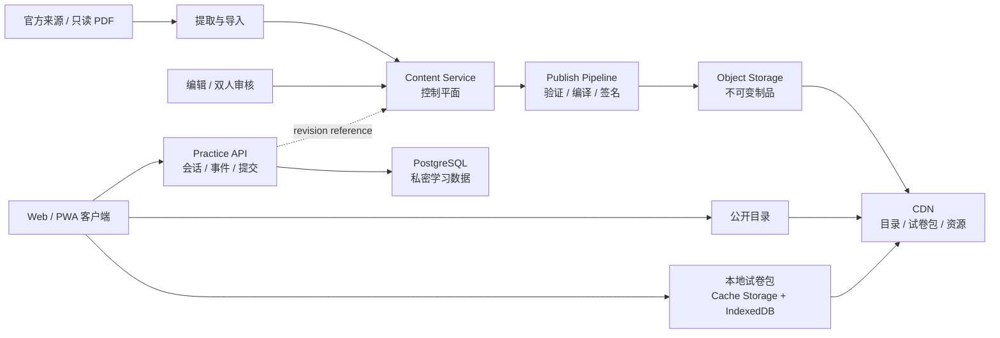

# 题库服务与离线练习架构方案

**状态：** 提议  
**日期：** 2026-07-23  
**适用范围：** Admission Test Breaker 的题目导入、审核、发布、分发与学生练习  
**上位约束：** `docs/product/PRODUCT_CHARTER.md`、`docs/architecture/SYSTEM_ARCHITECTURE.md`

## 1. 决策摘要

题库适合形成一个可独立演进的服务边界，但不应让学生练习过程实时依赖题库服务逐题响应。

采用“控制平面与分发平面分离”的架构：

1. **Content Service（控制平面）**负责来源、提取、编辑、审核、版本、发布和撤回；
2. **Publish Pipeline（发布流水线）**把已审核内容编译为不可变、带摘要和签名的试卷包；
3. **Object Storage + CDN（分发平面）**负责高可用、低成本地分发公开目录和试卷包；
4. **Web 客户端（练习运行时）**在开始练习前原子下载并校验一个固定 revision，保存到本地；
5. **Practice API**只保存会话、事件、提交和结果，不拥有题目正文；
6. 正在进行的会话永远绑定开始时的 `paperRevisionId`，后台更新不能静默改变历史事实。

这一方案既保留独立题库服务带来的维护效率，也避免题库后台维护、发布或短暂故障打断学生考试。

## 2. 为什么不是“每道题实时调用题库 API”

如果练习页每次翻题都请求 Content Service，会产生不必要的运行耦合：

- 题库服务故障会中断正在进行的考试；
- 网络抖动会影响翻题和公式、图形加载；
- 100 个并发学生会重复读取同一批不可变内容；
- 后台发布新 revision 时，进行中的会话可能前后看到不同版本；
- Content Service 同时承担编辑后台与学生运行流量，权限和扩容边界变得模糊；
- 离线练习、弱网恢复和 CDN 缓存难以可靠实现。

题目内容具有“少写多读、发布后不可变”的特点，更适合编译为版本化制品并通过 CDN 分发。

## 3. 目标与非目标

### 3.1 目标

- 题目、试卷、答案、解析、图形和标签可以独立维护；
- 自动提取内容不能绕过人工审核直接发布；
- 每次发布产生不可变 revision，并可审计、撤回和回滚；
- 学生可以预下载试卷，在弱网或断网下完成练习；
- 正在进行和历史会话始终可重现原始内容；
- 公开练习支持完全离线作答与评分；
- 受控诊断可以离线作答，但不把受保护答案提前发给客户端；
- 100 个并发学生主要由 CDN 承载，而不是压到应用数据库；
- 未来可独立部署 Content Service，但当前不强制过早拆成微服务。

### 3.2 非目标

- 不允许发布后原地修改 revision；
- 不用客户端加密伪装真正的答案保密；
- 不让 Content Service 读取学生作答、档案或 Learner Space；
- 不把原始 PDF 或内部审核材料直接打入公开试卷包；
- 不在第一阶段引入多套消息中间件或复杂微服务治理。

## 4. 系统全景



### 4.1 信任域

| 信任域 | 包含 | 禁止 |
| --- | --- | --- |
| Public Content | 已发布题目、试卷、图形、公开答案与解析 | 读取学生数据 |
| Content Operations | 原始来源、提取草稿、审核意见、发布权限 | 被浏览器直接访问 |
| Private Learner | 会话、作答、计时、事件、结果、授权 | 拥有或原地修改题目正文 |
| Aggregate Research | 达到门槛后的匿名统计 | 回查单个学生或小群体 |

## 5. Content Service 的职责

### 5.1 负责

- Exam、Paper、Question 的稳定 ID；
- 每个实体的 revision 和状态机；
- 官方来源、许可、哈希、页码和 provenance；
- 自动提取 bundle 导入；
- 公式、图形、选项、答案和解析编辑；
- taxonomy、knowledge、skill 和 error 标签；
- 审核任务、审核人、审核结论和变更原因；
- 发布前 schema、资源、答案和引用完整性验证；
- 生成发布候选、撤回记录和审计日志；
- 输出机器可读发布事件或 outbox 记录。

### 5.2 不负责

- 创建或提交 Practice Session；
- 保存学生答案或时间事件；
- 计算个体结果、Benchmark 或 AI 解读；
- 处理学生账户、Grant 或 RLS；
- 在学生请求路径中动态拼装整套试卷。

## 6. 内容生命周期

沿用现有阶段并补足发布语义：

```text
discovered
→ indexed
→ extracted
→ needs_review
→ verified
→ release_candidate
→ published
→ withdrawn
```

关键规则：

1. 自动提取最多进入 `needs_review`；
2. `verified` 必须记录审核人、审核时间、来源 revision 和变更原因；
3. 发布操作创建新的不可变 `PaperRevision`，不能覆盖旧 revision；
4. `withdrawn` 阻止新会话下载，但不能删除历史会话所引用的制品；
5. 紧急撤回需要区分内容错误和安全事件；
6. 删除源文件不能破坏已发布 revision 的可重现性；
7. 同一发布命令使用 idempotency key，重复执行不能创建两个 revision。

## 7. 核心数据模型

```ts
interface Exam {
  id: string;
  slug: string;
  name: string;
  status: "draft" | "published" | "archived";
}

interface Paper {
  id: string;
  examId: string;
  edition: string;
  paperCode: string;
}

interface PaperRevision {
  id: string;
  paperId: string;
  revision: number;
  schemaVersion: number;
  durationMinutes: number;
  questionRevisionIds: string[];
  distributionPolicy: "public_offline" | "controlled_online_score";
  status: "release_candidate" | "published" | "withdrawn";
  contentDigest: string;
  publishedAt?: string;
}

interface QuestionRevision {
  id: string;
  questionId: string;
  revision: number;
  prompt: QuestionBlock[];
  options: PracticeOption[];
  correctAnswer?: string;
  solution?: QuestionBlock[];
  sourceRefs: SourceReference[];
  review: ReviewDecision;
}

interface PracticeSessionContentRef {
  paperId: string;
  paperRevisionId: string;
  packageDigest: string;
}
```

稳定 ID 表示内容身份，revision 表示某次不可变内容。学生事件和结果只引用 revision，不复制题目正文。

## 8. 发布制品

### 8.1 公开目录

`catalog.json` 只包含发现和下载所需的公开元数据：

```json
{
  "schemaVersion": 1,
  "generatedAt": "2026-07-23T00:00:00.000Z",
  "exams": [
    {
      "id": "tmua",
      "papers": [
        {
          "paperId": "tmua-2023-p1",
          "latestRevisionId": "prv_tmua_2023_p1_1",
          "distributionPolicy": "public_offline",
          "packageUrl": "/content/packages/prv_tmua_2023_p1_1.json",
          "sha256": "..."
        }
      ]
    }
  ]
}
```

目录可以短缓存并使用 ETag；试卷包使用内容寻址或 revision 路径，设置长期 immutable 缓存。

### 8.2 试卷包

试卷包至少包含：

- schema version；
- exam、paper 和 revision 标识；
- 练习时长和题目顺序；
- 已审核题干、选项和可公开资源引用；
- distribution policy；
- 资源清单及每个资源的 SHA-256；
- 整包摘要和服务端签名；
- 最低兼容客户端版本；
- 生成时间，但不以生成时间作为缓存身份。

图形和字体等二进制资源使用内容哈希 URL，避免同名覆盖。

### 8.3 两种分发策略

#### `public_offline`

适用于公开真题和普通练习：

- 题目、答案和解析均可下载；
- 完全离线作答、提交和评分；
- 用户可以检查浏览器内容，因此不宣称答案保密；
- 联网后只同步学习事件和结果。

#### `controlled_online_score`

适用于不应提前暴露答案的诊断：

- 下载包只包含题目和选项；
- 正确答案与评分规则留在服务端；
- 离线时可以继续作答并写入 outbox；
- 恢复网络后提交并获得最终评分；
- 客户端可以显示“已完成，等待联网评分”，不能伪造结果。

把答案加密后随包下发只能提高查看门槛，不能构成真正保密。只要解密密钥最终交给不受信任的浏览器，用户就能提取答案，因此不把这种方式作为安全边界。

## 9. 客户端离线练习

### 9.1 下载流程

```text
选择试卷
→ 获取 catalog 与目标 revision
→ 检查客户端兼容性和本地空间
→ 下载 manifest、JSON 与二进制资源
→ 校验每个 digest 和整包签名
→ 写入临时 cache namespace
→ 全部成功后原子标记为 ready
→ 创建绑定该 revision 的 Practice Session
```

下载失败不能留下“部分可用”的包。客户端应显示下载大小、状态、失败原因和重试入口。

### 9.2 本地存储分工

| 数据 | 建议存储 |
| --- | --- |
| HTML、JS、CSS、字体和图形 | Service Worker + Cache Storage |
| 试卷 manifest 与结构化题目 | IndexedDB |
| Session、事件和同步 outbox | IndexedDB |
| 小型偏好设置 | localStorage |

不再使用单个 `localStorage` key 保存整场练习。

### 9.3 Revision 固定

- Session 创建后固定 `paperRevisionId` 和 `packageDigest`；
- catalog 出现新版时只提示，不自动替换进行中的包；
- 历史结果优先使用原 revision；
- 清理缓存时不能删除活跃会话或未同步结果引用的 revision；
- 旧客户端不支持新 schema 时必须拒绝开始，而不是尽力猜测字段。

### 9.4 离线事件与同步

本地事件进入 append-only outbox：

```ts
interface PendingLearningEvent {
  id: string;
  sessionId: string;
  sequence: number;
  expectedSessionVersion: number;
  occurredAt: string;
  payload: unknown;
  syncStatus: "pending" | "synced" | "conflict";
}
```

同步规则：

- 事件 ID 和 sequence 用于幂等；
- 服务端验证 `paperRevisionId`、Session 所属和版本；
- 重复上传返回成功但不重复写入；
- 冲突不能静默 last-write-wins；
- 提交事件成功前保留 outbox；
- 受控诊断以服务端接收和评分为最终事实；
- 游客模式继续明确说明只保存在当前设备，除非用户主动接管到 Learner Space。

## 10. API 边界

### 10.1 Content Operations API

仅供内容后台和受信任流水线：

```text
POST /content-imports
GET  /review-tasks
PUT  /question-revisions/:id
POST /question-revisions/:id/verify
POST /papers/:paperId/release-candidates
POST /release-candidates/:id/publish
POST /paper-revisions/:id/withdraw
```

要求强认证、最小角色权限、审计和 idempotency key。

### 10.2 Public Content API

公开运行时不需要复杂动态 API：

```text
GET /content/catalog.json
GET /content/packages/:paperRevisionId.json
GET /content/assets/:sha256
```

这些路径由对象存储和 CDN 承载。Content Service 不位于学生翻题的同步请求路径。

### 10.3 Practice API

```text
POST /practice-sessions
GET  /practice-sessions/:sessionId
POST /practice-sessions/:sessionId/events
POST /practice-sessions/:sessionId/submit
GET  /practice-sessions/:sessionId/results
```

`POST /practice-sessions` 必须验证 revision 当前允许新建会话。会话创建后，即使 revision 后续撤回，也应依据撤回原因决定允许完成、强制终止或只保留审计，不能由内容服务删除学生事实。

## 11. 可用性与 100 人并发

这一架构把主要读流量转移到 CDN：

- 100 人下载同一试卷时，源站通常只需要回源一次；
- 练习过程在本地读取题目，不产生逐题 API 请求；
- Content Service 的编辑和发布负载与学生练习负载隔离；
- Practice API 只处理低带宽事件和提交；
- Content Service 暂时不可用不影响已下载试卷；
- CDN 短暂不可用不影响已完成下载的进行中会话。

首个生产形态仍采用模块化单体即可：

```text
一个代码仓库
├── Web
├── Application API
├── Content Module
├── Practice Module
└── Publish Worker
```

Content Module 使用独立 schema、接口和对象存储前缀。只有出现独立伸缩、团队所有权、发布安全或故障隔离的真实需求时，才把它部署为独立进程或独立服务。服务边界先于部署边界。

## 12. 安全、版权与隐私

- Content Service 不接收 Learner Space ID 或学生答案；
- 内容运营后台与公开 CDN 使用不同域名、凭证和网络策略；
- 发布凭证只授予写入临时 staging，最终 promote 由受控发布身份执行；
- 对象存储禁止公开列目录，只开放明确发布前缀；
- 包签名用于检测篡改，不用于隐藏公开答案；
- CSP 仅允许内容资源域和必要的应用 API；
- 原始 PDF、内部路径、审核意见和未授权材料不得进入公开包；
- 日志记录 revision、digest 和操作人，不记录无必要的题目全文；
- 撤回不能伪造删除学生已发生的学习事件；
- 许可状态是发布门，不是备注字段。

## 13. 可观测性

### Content Service

- 导入成功率和失败原因；
- 待审核数量与停留时间；
- 发布验证失败数；
- 每个 revision 的发布、撤回和回滚审计；
- 对象存储写入和 CDN purge 结果。

### 分发与客户端

- catalog/package 请求成功率；
- CDN cache hit ratio；
- 包下载 p50/p95、大小和 digest 失败率；
- 离线开始率、下载中断率和本地空间不足率；
- Service Worker 更新失败率。

### Practice API

- 事件写入 p95；
- outbox 同步积压；
- 重复事件命中率；
- 提交冲突率；
- revision 不兼容或已撤回拒绝率。

指标中不得包含学生答案正文。

## 14. 测试与发布门

### 14.1 内容契约

- JSON Schema 和 TypeScript 类型一致；
- 自动提取不能进入 published；
- digest、签名和资源引用完整；
- 未授权来源不能发布；
- 同一 revision 重复发布保持幂等；
- 已发布 revision 不可修改。

### 14.2 客户端离线 E2E

```text
在线下载试卷
→ 关闭网络
→ 开始、恢复、作答和提交
→ 刷新页面
→ 继续读取同一 revision
→ 恢复网络
→ 幂等同步事件
→ 查看结果
```

还需覆盖：

- 下载到一半失败；
- digest 不匹配；
- 存储空间不足；
- 新 revision 发布时旧 Session 不漂移；
- 两个标签页并发写入；
- Service Worker 更新；
- 受控诊断离线完成后等待联网评分；
- withdrawn revision 的各类处置。

### 14.3 容量验证

- 100 VU 同时下载同一公开包；
- CDN 命中和 origin 回源次数符合预算；
- 100 个活跃 Session 同步事件；
- 同时提交峰值；
- Content Service 停机时已下载练习继续运行；
- Publish Pipeline 失败不能污染 latest catalog。

建议首批目标：

| SLI | 目标 |
| --- | --- |
| CDN 内容可用性 | 99.9% |
| 完整包校验失败率 | < 0.01% |
| 已下载试卷离线打开成功率 | > 99.9% |
| Practice 事件写入 p95 | < 300ms |
| Session 恢复 p95 | < 500ms |
| 跨租户越权 | 0 |

## 15. 仓库目标结构

不要求第一步立即移动全部文件，最终可演进为：

```text
apps/
├── web/
├── api/
└── content-admin/
packages/
├── content-contracts/
├── practice-domain/
├── ui/
└── verification/
workers/
└── content-publisher/
content/
└── tmua/
```

在后端尚未开始前，可以保留当前单包结构，通过模块边界先完成迁移：

```text
src/content/                 # 导入、审核前验证与领域契约
src/platform/content/        # 运行时公开内容契约
src/features/practice/       # 只引用 PaperRevision
src/adapters/content-local/  # 当前仓库 JSON 适配器
src/adapters/content-cdn/    # 后续 catalog/package 适配器
```

## 16. 分阶段迁移方案

### 阶段 A：统一内容契约

1. 将 `PracticePaper.id`、exam、edition 和 paper 从字面量改为通用类型；
2. 合并 corpus shell、extracted draft 和 runtime question 的共享 revision 契约；
3. 为现有 TMUA 2023 Paper 1 生成首个不可变 package；
4. Session 增加 `paperRevisionId` 和 `packageDigest`；
5. 保持现有静态 import 适配器，避免一次性改写 UI。

**完成标准：** 当前 20 题继续通过全部测试，结果可以精确追溯到 revision。

### 阶段 B：本地下载与离线运行

1. 增加 catalog/package 客户端；
2. 使用 IndexedDB 和 Cache Storage；
3. 引入 Service Worker；
4. 增加下载管理、空间提示和原子安装；
5. 增加离线 outbox 与多标签页协调；
6. 使用 Playwright 覆盖离线完整旅程。

**完成标准：** 下载完成后断网、刷新仍可完成公开练习。

### 阶段 C：内容控制平面

1. 将现有 CLI bundle 接入 Content Service import；
2. 建立 PostgreSQL content schema；
3. 实现审核任务和双人审核；
4. 实现 Publish Pipeline、签名、对象存储和 catalog promote；
5. 建立发布审计、撤回和回滚。

**完成标准：** 新试卷无需修改 Web 代码即可审核并发布。

### 阶段 D：生产 Practice API

1. 接入身份、Learner Space 和 RLS；
2. 实现事件 append、版本控制和幂等提交；
3. 实现 Guest Session 显式接管；
4. 实现服务端结果投影和受控诊断评分；
5. 建立备份恢复、日志指标和 100 VU 压测。

**完成标准：** 100 个并发学生通过负载与跨租户安全门。

### 阶段 E：按证据决定是否独立部署

只有满足以下至少一项时才独立部署 Content Service：

- 内容团队需要独立发布节奏和权限边界；
- 内容导入/转换显著消耗 CPU 或内存；
- Content Operations 需要更严格网络隔离；
- 学生运行流量影响内容后台；
- 单体部署已经造成明确故障域或扩容成本。

独立部署后仍保持相同契约和发布制品，Web 客户端不需要改成逐题调用服务。

## 17. 对当前代码的直接修改清单

| 当前位置 | 修改 |
| --- | --- |
| `src/features/practice/content/types.ts` | 去除固定 `"tmua-2023-p1"` 字面量，加入 revision、digest 和 distribution policy |
| `src/features/practice/content/tmua-2023-p1.ts` | 转换为首个发布包来源或生成结果 |
| `src/features/practice/content/validate.ts` | 从固定 20 题规则拆为考试规格规则与通用包完整性规则 |
| `src/content/tmua/types.ts` | 与 runtime `QuestionRevision` 建立共享契约，避免双模型漂移 |
| `src/content/tmua/extraction.ts` | 输出可由 Content Service 导入的版本化 bundle |
| `src/features/practice/domain/session.ts` | 增加不可变 `paperRevisionId` 和 `packageDigest` |
| `src/features/practice/storage/` | 从单键 localStorage 迁移至 IndexedDB repository |
| `src/app/dependencies.ts` | 注入 ContentCatalog、PaperPackage 和 Outbox repository |
| `src/app/routes.tsx` | 使用通用 examId/paperId 路由，不为每套试卷复制页面 |
| `verification/features/` | 增加 content publish 与 offline practice 独立功能清单 |

## 18. 最终验收标准

只有以下条件全部满足，才可以宣称“独立题库服务与离线练习已完成”：

1. 内容更新不需要修改或重新构建 Web 应用；
2. 未审核内容无法进入公开 catalog；
3. 每场练习固定 revision，更新后历史结果不漂移；
4. 公开试卷下载后可以断网完成；
5. 受控诊断不向客户端提前发送受保护答案；
6. 包篡改、资源缺失和 schema 不兼容会被明确拒绝；
7. Content Service 故障不会中断已下载练习；
8. 重复同步和重复提交不会产生重复事件；
9. 撤回、回滚和旧 revision 保留策略有自动化测试；
10. 100 VU 下载、同步和提交通过既定 SLO；
11. Content Service 无权读取学生私密数据；
12. README、系统架构、功能清单和实际部署状态一致。

## 19. 结论

独立题库服务可以融合进当前架构，而且与既有 Content Commons、Practice Engine 和 revision 原则一致。关键不是“把题目放进另一个 HTTP 服务”，而是建立清晰的内容控制平面、不可变发布制品和稳定分发平面。

学生侧应优先下载并固定一个经过校验的试卷包。本地运行降低网络依赖和 100 人并发成本；服务端只承担必须共享和受信任的能力，例如账户、事件同步、受控评分、授权和审计。这样既便于持续更新题库，也不会牺牲考试过程的稳定性、可重现性和隐私边界。
