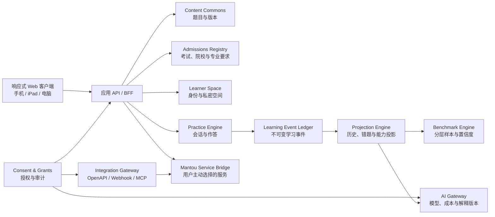

# Admission Test Breaker 系统架构

**状态：** 生效
**日期：** 2026-07-17
**架构形态：** API-first 模块化单体，事件账本与版本化投影
**上位约束：** `docs/product/PRODUCT_CHARTER.md`

## 1. 架构目标

系统首先支持一个完整而可信的学生旅程，同时为多考试、多人授权协作、公平 Benchmark、可配置 AI 和外部 Agent 接入保留稳定边界。初期采用模块化单体，避免在业务边界尚未稳定时引入微服务运维成本；模块之间通过领域接口和事件契约协作，未来可按负载或治理需要拆分。

## 2. 系统全景



## 3. 信任域

### 3.1 Public Content Domain

包含题目、试卷、答案、标签、来源、审核和内容版本。可以在开源仓库中协作，不能依赖或引用任何真实学生记录。

### 3.2 Private Learner Domain

包含账户、学习空间、会话、作答、计时、错误、计划、批注、授权和 AI 运行。所有记录都必须带数据归属和租户边界；任何读取都经过身份与授权判定。

### 3.3 Aggregate Research Domain

包含达到门槛后的匿名聚合和 Benchmark 快照。它只能从受控投影生成，不能反向暴露单个学生或小群体。

三个信任域可以共享稳定 ID 和版本引用，但不能共享存储访问权限。

## 4. 领域模块

| 模块 | 责任 | 明确不负责 |
| --- | --- | --- |
| Identity & Learner Space | 登录身份、学生私密空间、成员关系、数据归属 | 具体练习逻辑、第三方授权 |
| Content Commons | 题目/试卷版本、来源、许可、审核、贡献工作流 | 学生作答与个体统计 |
| Admissions Registry | 按申请年度维护考试、院校、专业、必需模块、来源和历史参考 | 预测个人录取结果、用旧年度覆盖当前要求 |
| Practice Engine | 创建和完成练习会话、答案状态、计时、提交幂等性 | 长期分析、AI 解释 |
| Learning Event Ledger | 追加目的明确、带版本的学习事件 | 修改历史事实、直接渲染报告 |
| Projection Engine | 从事件生成会话结果、错题、频率、技能和时间投影 | 伪造缺失事件、替代原始账本 |
| Consent & Grants | 逐项授权、限时、撤销、委托主体和访问审计 | 用角色名称代替权限判定 |
| Benchmark Engine | 分层样本、资格规则、统计快照、置信信息 | 未达门槛的个体排名 |
| AI Gateway | 提供商适配、路由、提示策略、预算、运行与审计 | 直接拥有学生数据、绕过授权 |
| Integration Gateway | OpenAPI、Webhook、MCP、飞书和 Agent 连接 | 永久共享万能令牌 |
| Mantou Service Bridge | 学生主动发起的咨询、报告或服务衔接 | 隐形导流、未经同意复制档案 |
| Admin & Trust | 内容审核、运维、滥用处置、合规请求、审计调查 | 无理由浏览学生内容 |

### 4.1 内容导入与解析边界

内容导入属于 Public Content Domain，不进入 Private Learner Domain。原始文件、解析结果、平台规范化文档、题目草稿与已发布 revision 分层保存：

```text
只读原始文件 + SHA-256 + 来源/许可
→ MinerU 或其他解析器原始输出
→ 平台 NormalizedImportedDocument
→ 题目/资料专用切分器
→ 人工审核
→ ContentRevision 发布
```

MinerU 是可替换的边缘适配器，不是平台数据模型。平台保存 provider、版本、backend、解析时间、页码、顺序和坐标，但业务代码不直接依赖 MinerU 的 `middle.json` 或 `content_list_v2.json`。所有自动解析结果必须保持 `reviewStatus = needs_review` 与 `publishable = false`；只有独立的内容审核流程可以创建可发布 revision。

在线原卷模式是独立的交付层，不把 OCR 草稿冒充结构化题目。它只在原始 Question Paper 和官方 Answer Key 的哈希均匹配 corpus 后，发布不可变 PDF、题号到原卷页码的映射及官方答案；Practice Engine 仍负责会话、在线答题卡、计时、事件与结果。原生结构化题和原卷模式使用同一个 `PracticePaper` 契约，但必须通过 `deliveryMode` 明确区分。原卷模式的“可在线练习”表示题面在线显示且答案可记录/评分，不表示公式、图形和知识标签已经逐题结构化。

内容解析默认不得包含或读取真实学生记录。云解析只用于已明确允许传输的内容文件；原创教研资料和未来用户上传文件优先采用私有部署，并由平台自己的持久任务队列、对象存储、重试和审计管理生命周期。

## 5. 核心实体与归属

| 实体 | 归属/控制者 | 关键版本或边界 |
| --- | --- | --- |
| `User` | 身份主体 | 身份提供方、状态 |
| `LearnerSpace` | 学生 | `ownerUserId`，一个学生可有一个或多个空间 |
| `Grant` | 学生创建并可撤销 | 受权主体、scope、资源范围、起止时间、状态 |
| `ContentRevision` | Content Commons | 内容 ID、revision、来源、审核状态、许可 |
| `ItemBlueprint` | Content Commons | 考试规格、目标技能、难度、生成方式和发布门 |
| `CourseRequirementRevision` | Admissions Registry | 申请年度、院校/专业、考试要求、官方来源和核验时间 |
| `OfficialHistoricalReference` | Admissions Registry | 指标定义、申请人群、历史年度、来源和限制说明 |
| `PracticeSession` | Learner Space | 试卷 revision、状态、开始/截止/提交时间 |
| `LearningEvent` | Learner Space | 单调序号、schema version、actor、发生时间、payload |
| `ProjectionSnapshot` | Learner Space | 投影类型、算法版本、截止事件序号 |
| `BenchmarkSnapshot` | Aggregate Domain | cohort definition、样本量、时间窗、算法和置信信息 |
| `Annotation` / `Plan` / `Assignment` | Learner Space | 作者、创建依据的 grant、可见范围 |
| `AIRun` | Learner Space | purpose、data scopes、provider/model、策略版本、Token/成本、输出 |
| `AuditRecord` | 平台受托保存 | actor、action、resource、decision、reason、time |

内容修订只能被引用，不能在学生完成后静默改变历史会话。投影可以重建，但必须保留算法版本和消费到的事件位置。

## 6. 学习事件账本

### 6.1 事件信封

所有学习事件使用稳定信封：

```ts
interface LearningEvent<TType extends string, TPayload> {
  id: string;
  schemaVersion: 1;
  learnerSpaceId: string;
  sessionId: string;
  sequence: number;
  type: TType;
  actor: { kind: "guest" | "student" | "teacher" | "parent" | "agent" | "system"; id: string };
  occurredAt: string;
  payload: TPayload;
}
```

首批学生练习事件包括：`session_started`、`question_viewed`、`answer_selected`、`answer_changed`、`question_marked`、`question_unmarked`、`submission_opened`、`session_submitted` 和 `session_expired`。

### 6.2 规则

- 账本追加，不原地覆盖；纠正通过新事件表达。
- `guest` 只用于明确的本地 Guest Space；它不授予 Learner Space 权限，也不能被服务端当作匿名账户。
- 同一会话序号连续，事件 ID 幂等，重复请求不能产生双重提交。
- 客户端时间仅作为观测；服务端接收时间和会话截止规则共同参与可信判断。
- 事件 payload 禁止任意自由文本和无关设备指纹；新增字段需要 schema 版本。
- 产品读模型从投影获取，审计和重算才直接读取事件。

## 7. 授权模型

### 7.1 首批 Scope

- `progress:read`：查看聚合进度和历史；
- `responses:read`：查看题目级作答与用时；
- `annotations:write`：增加批注；
- `plans:write`：制定或修改训练计划；
- `assignments:write`：布置练习；
- `ai-insights:read`：查看指定 AI 解读；
- `ai-insights:run`：在授权数据范围内发起解读；
- `data:export`：导出明确资源；
- `integration:operate`：通过指定集成执行被允许动作。

### 7.2 授权判定

访问能力取决于：主体身份、Learner Space、scope、资源过滤器、有效期、授权状态和用途。`teacher`、`parent` 或 `agent` 角色本身不授予任何数据访问。

每次敏感读取和写入产生审计记录。撤销后新请求立即失败，长任务在下一安全检查点停止。外部 Token 使用短时凭证、最小 scope 和可轮换密钥。

## 8. 多租户与存储

生产目标存储为 PostgreSQL。私密表包含 `learner_space_id`，并同时实施：

1. 应用服务的授权策略；
2. 数据库 Row-Level Security；
3. 后台任务的显式租户上下文；
4. 跨租户负面测试与审计。

对象存储使用按租户和用途隔离的 key；日志默认不包含题目级答案、提示上下文或密钥。备份继承相同的加密、保留和删除策略。

第一阶段本地浏览器适配器只是 Reference Journey 的临时实现，必须实现与未来服务端仓储相同的领域接口，并在界面中明确标注“当前设备保存”。它不是生产多租户方案。

2026-07-15 已建立第一版 Supabase-compatible 私密账户底座：`auth.users` 创建后自动生成 `app_users` 与单一 `learner_spaces`；课程档案、练习会话、学习事件和内容 entitlement 均启用 RLS；邀请码只保存规范化后的 SHA-256 digest，服务端原子核销并限制次数与有效期；学习事件只允许追加、连续序号和当前学生 actor。该切片已通过跨租户负面测试和真实本地 HTTP 流程，但尚未绑定云端项目，也尚未用服务端仓储替换现有 Guest Space 本地练习数据，因此不能被描述为生产多租户已经上线。

内容 entitlement 与学习数据 Grant 是两个独立权限面：前者回答“学生可以访问哪些模考或笔记”，后者回答“谁可以基于什么目的读取或操作学生数据”。邀请码提供者、销售老师和内容运营者不会因为发出邀请码而获得任何 Learner Space 权限。

## 9. Benchmark 架构

Benchmark 采用版本化快照而不是实时扫描原始作答：

```text
已完成且符合条件的会话
→ 数据质量与环境资格过滤
→ 去标识化分层聚合
→ 最小样本/重识别门槛
→ 带 cohort、样本量、算法和置信度的快照
→ 个体结果按兼容条件比较
```

首批 cohort 至少区分考试、paper、内容 revision、完成模式、时间窗和备考阶段。低于发布阈值只返回 `insufficient_sample`，不返回占位百分位。训练时间估计必须表达区间和假设。

Benchmark 输出必须区分：原始会话事实、平台 cohort 参考、经校准的模拟准备度、院校官方历史参考。Admissions Registry 的历史数据可以与学生结果并列展示，但不能被 Benchmark Engine 改写成录取概率。未经 anchor、固定 form、完成条件和统计校准的短诊断不得映射为官方 1–9 分。

## 9.1 游客空间与账户接管

课程信息、知识覆盖和本地练习允许使用 `GuestSpace`。它拥有随机 ID、版本化事件和明确的本地边界，但不是已认证的 `LearnerSpace`，也不在服务端形成可跨设备追踪的匿名画像。

学生创建账户时，应用通过显式确认将选定 guest sessions 幂等迁移到学生 Learner Space。迁移成功后 guest source 标记为已接管，不能被第二个账户重复接管；迁移失败不能删除本地来源数据。生产跨设备存储仍必须先通过身份、RLS 和跨租户负面测试。

当前本地 Reference Journey 已接受受限的 `guest` actor，并把练习与课程信息绑定到稳定的本地 `GuestSpace`。服务端授权边界仍拒绝把 Guest 当作认证账户；生产多租户能力继续依赖身份、PostgreSQL、RLS 和跨租户负面测试。

## 10. AI Gateway

业务模块提交 `AIJob`，而不是直接调用模型 SDK：

```ts
interface AIJob {
  purpose: "session_review" | "longitudinal_review" | "teacher_assist";
  learnerSpaceId: string;
  requestedBy: string;
  grantId?: string;
  inputProjectionRefs: string[];
  policyVersion: string;
  budget: { maxInputTokens: number; maxOutputTokens: number; maxCostMinor: number };
}
```

Gateway 负责授权复核、上下文最小化、敏感字段处理、提供商路由、BYOK/平台密钥选择、重试、预算、提示策略版本和运行审计。输出写为独立的 `InsightSnapshot`，不改写学习事件或统计事实。

## 11. 外部平台与 Agent 接入

- OpenAPI 是稳定服务契约；Web 客户端也消费同一领域 API。
- Webhook 只发送事件摘要和资源引用，订阅者凭授权再读取详情。
- MCP/Agent 工具暴露任务级动作，例如“读取被授权的本周进度”或“创建训练计划”，不暴露数据库查询能力。
- 飞书等办公平台通过 Integration Gateway 映射身份和权限，不能绕过 Grant。
- 所有外部动作携带 actor、grant、purpose 和 idempotency key，并写入审计。

## 12. 客户端与响应式架构

客户端使用 React、Vite、成熟无障碍 primitives 和产品自有设计系统。采用内容优先的响应式布局，不为手机、iPad、桌面维护三套业务逻辑：

- 同一领域状态和组件语义；
- CSS token、container/breakpoint 和布局组合负责适配；
- 桌面持久侧栏、iPad 按方向收放、手机底部操作与弹层；
- 所有关键动作保持至少 44px 触控目标、键盘能力和可见焦点；
- 关键视口与 reduced-motion 进入自动化与人工视觉验证。

配色以满托紫 `#63528C`、深墨 `#282332`、灰 `#76777A`、暖纸 `#F7F1E7` 和抬升纸面 `#FFFDF8` 为基础。成熟组件提供行为，自有 token 与组合组件提供品牌和细节。

TMUA Reference Journey 采用分阶段路由，而不是在单个长页面内渲染所有能力：公开考试介绍不读取私密练习会话；填写本地课程信息后，知识覆盖、个人准备首页、诊断状态、真题资料馆和资料入口分别成为独立页面。个人准备首页只推荐当前真实可完成的动作，未开放模块不得占据主 CTA。课程覆盖由版本化的课程模块映射确定性生成，不调用 AI，也不写入能力分数；真实能力必须来自后续作答证据。

课程覆盖页面回答的是“当前课程范围是否需要额外知识课”，不是“学生是否已经掌握”。每个知识领域必须同时提供中英文名称、课程证据、具体复习/补学主题和教师规划时间区间。`direct` 建议先复习与检查题，不默认安排额外知识课；`related` 先做缺口检查；`not-evidenced` 必须写成“课程档案未显示覆盖”，不能写成“不会”，并同时给出熟悉则直接练题、陌生才进入基础学习的分支。所有时间都是保守备课区间，不是训练时长 Benchmark。

## 13. 依赖规则

```text
UI / Adapters
    ↓
Application Use Cases
    ↓
Domain Contracts

Content Domain ──仅通过 ContentRevision 引用──> Practice Domain
Private Learner Domain ──不得被──> Public Content tooling 导入
AI / Integration Adapters ──不得被──> Core domain 导入
Projections ──只消费事件，不反向修改──> Event Ledger
```

- 领域层不导入 React、浏览器存储、数据库或模型 SDK。
- 账户领域契约不导入 Supabase SDK；Supabase 只作为浏览器/服务端适配器实现，以便未来更换身份或部署形态。
- 页面只调用用例/仓储接口，不直接操作持久化。
- Content Commons 不得依赖任何 learner、grant、session 私密模块。
- AI 和集成提供商代码位于适配器边缘。
- 跨模块引用和禁止依赖由架构测试自动扫描。

## 14. 独立验证层

每项功能有可由 Agent 单独运行的验证层：

| 层级 | 验证内容 | 失败效果 |
| --- | --- | --- |
| V0 静态契约 | TypeScript、JSON Schema、内容 schema、依赖边界 | 阻止合并 |
| V1 领域行为 | reducer、授权决策、事件幂等、投影、Benchmark 资格 | 阻止合并 |
| V2 适配器 | 本地存储、PostgreSQL/RLS、AI provider、Webhook 合约 | 阻止发布相关模块 |
| V3 用户旅程 | 真实题目的端到端开始/恢复/提交/报告/授权 | 阻止发布 |
| V4 非功能 | 无障碍、响应式、性能、安全、备份恢复 | 按风险阻止发布 |
| V5 架构审计 | 模块依赖、数据归属、权限覆盖、文档同步 | 阻止架构漂移 |

验证代码与生产实现分离；测试不能通过复制生产逻辑获得“假绿”。每个发布项必须在总验证矩阵中有负责人、命令和证据。

已交付功能在 `verification/features/*.yaml` 中声明用户结果、可核验主张、代码证据、自动命令、人工视口检查和明确非能力边界。`pnpm verify:features` 可独立检查清单结构、证据路径与命令是否真实存在；`pnpm verify` 同时执行架构、功能、内容、单元、类型和构建门禁。

私密账户切片额外提供两级门禁：`pnpm verify:supabase-contracts` 在普通验证中静态检查 RLS、服务端密钥边界和认证基线；`pnpm verify:supabase` 在本地 Supabase 运行时执行 26 项 pgTAP 数据库隔离测试，并通过真实 HTTP 完成邀请码预检、登录、核销和本人 entitlement 查询。

## 15. 初期部署形态

首个生产形态采用满托账号下的 managed hosted Supabase 承载身份、PostgreSQL、RLS、对象存储与 Edge Function，Web 客户端与后续应用服务部署到云端。迁移、seed、函数和验证全部保存在仓库并由 CLI 执行，避免生产配置只存在 GUI。事件投影、Benchmark 与 AI 任务通过持久任务队列异步执行；只有当数据驻留、成本、独立伸缩或隔离出现实际证据时，再评估自托管 Supabase 或拆分服务。

当前 Vite 应用与本地 Supabase 是 Reference Journey 和生产兼容底座，不代表云端后端已经完成。任何“本地可体验”能力都必须在界面和文档中区分原型存储与生产隐私保证。
