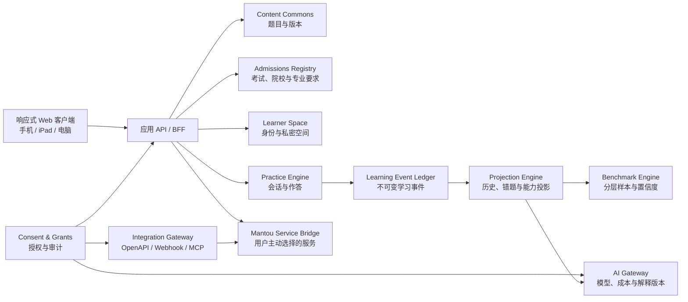

# Admission Test Breaker 系统架构

**状态：** 生效
**日期：** 2026-07-17
**架构形态：** API-first 模块化单体，事件账本与版本化投影
**上位约束：** `docs/product/PRODUCT_CHARTER.md`

## 1. 架构目标

系统首先支持一个完整而可信的学生旅程，同时为多考试、多人授权协作、公平 Benchmark、可配置 AI 和外部 Agent 接入保留稳定边界。初期采用模块化单体，避免在业务边界尚未稳定时引入微服务运维成本；模块之间通过领域接口和事件契约协作，未来可按负载或治理需要拆分。

## 2. 系统全景



## 3. 信任域

### 3.1 Public Content Domain

包含题目、试卷、答案、标签、来源、审核和内容版本。可以在开源仓库中协作，不能依赖或引用任何真实学生记录。

### 3.2 Private Learner Domain

包含账户、学习空间、会话、作答、计时、错误、计划、批注、授权和 AI 运行。所有记录都必须带数据归属和租户边界；任何读取都经过身份与授权判定。

### 3.3 Aggregate Research Domain

包含达到门槛后的匿名聚合和 Benchmark 快照。它只能从受控投影生成，不能反向暴露单个学生或小群体。

三个信任域可以共享稳定 ID 和版本引用，但不能共享存储访问权限。

## 4. 领域模块

| 模块 | 责任 | 明确不负责 |
| --- | --- | --- |
| Identity & Learner Space | 登录身份、学生私密空间、成员关系、数据归属 | 具体练习逻辑、第三方授权 |
| Content Commons | 题目/试卷版本、来源、许可、审核、贡献工作流 | 学生作答与个体统计 |
| Admissions Registry | 按申请年度维护考试、院校、专业、必需模块、来源和历史参考 | 预测个人录取结果、用旧年度覆盖当前要求 |
| Practice Engine | 创建和完成练习会话、答案状态、计时、提交幂等性 | 长期分析、AI 解释 |
| Learning Event Ledger | 追加目的明确、带版本的学习事件 | 修改历史事实、直接渲染报告 |
| Projection Engine | 从事件生成会话结果、错题、频率、技能和时间投影 | 伪造缺失事件、替代原始账本 |
| Consent & Grants | 逐项授权、限时、撤销、委托主体和访问审计 | 用角色名称代替权限判定 |
| Benchmark Engine | 分层样本、资格规则、统计快照、置信信息 | 未达门槛的个体排名 |
| AI Gateway | 提供商适配、路由、提示策略、预算、运行与审计 | 直接拥有学生数据、绕过授权 |
| Integration Gateway | OpenAPI、Webhook、MCP、飞书和 Agent 连接 | 永久共享万能令牌 |
| Mantou Service Bridge | 学生主动发起的咨询、报告或服务衔接 | 隐形导流、未经同意复制档案 |
| Feedback & Correction | 学生站内纠错/故障回执、确定性分级、处理状态与审计 | 自动读取作答、收集联系方式、用 AI 决定安全优先级 |
| Admin & Trust | 内容审核、运维、滥用处置、合规请求、审计调查 | 无理由浏览学生内容 |

### 4.1 内容导入与解析边界

内容导入属于 Public Content Domain，不进入 Private Learner Domain。原始文件、解析结果、平台规范化文档、题目草稿与已发布 revision 分层保存：

```text
只读原始文件 + SHA-256 + 来源/许可
→ MinerU 或其他解析器原始输出
→ 平台 NormalizedImportedDocument
→ 题目/资料专用切分器
→ 人工审核
→ ContentRevision 发布
```

MinerU 是可替换的边缘适配器，不是平台数据模型。平台保存 provider、版本、backend、解析时间、页码、顺序和坐标，但业务代码不直接依赖 MinerU 的 `middle.json` 或 `content_list_v2.json`。所有自动解析结果必须保持 `reviewStatus = needs_review` 与 `publishable = false`；只有独立的内容审核流程可以创建可发布 revision。

在线原卷模式只保留为导入期的兼容契约，不是当前 TMUA 的交付形态，也不能把 OCR 草稿冒充结构化题目。Practice Engine 继续统一负责会话、答题、计时、事件与结果；任何新导入内容在发布前必须完成题面、选项、答案、图形和来源页核验。

原生发布是最终交付形态：语义文本和 KaTeX 公式直接进入题目数据，图形使用经过审核、无脚本和外链的独立 SVG。结构化试卷禁止包含 `source-pdf` block；manifest 必须把 `publicDocumentPath` 设为 `null`，构建器同时清除旧的公开 PDF。当前 18 套 TMUA 真题、360 道题和独立的 8 道/30 分钟原创起点诊断全部满足该契约；extraction bundle 只作为人工审核输入，不能直接改变 manifest 的交付模式。

考试规格、官方 Guide、历年资料页和外部互动样题统一进入版本化官方来源 registry。registry 只保存考试、资料类型、发布者、核验日期、原始链接、交付方式和权利状态；默认产品交付为 `link_only`。把官方链接记录进系统不等于取得下载、修改、复制或商业再发布许可，未经书面许可的文件不能进入平台可发布内容库、公开 Web bundle，也不能被自动导入器直接发布为平台内容。

内部教研可以在 Git 忽略的 `content/official/raw/` 保存官网页面快照和原始 PDF/RTF，但必须由 `research-asset-inventory.json` 记录 URL、发现页面、SHA-256、大小、用途和权利状态。该目录不得被 `public/`、生产构建或公开对象存储引用。内部下载状态只证明文件可读，不能改变 `publishable: false`；满托 Notes 需要独立撰写、来源 claim 映射、相似度检查、学科复核和单独 publication revision。

原创复习资料采用单一内容源：版本化 JSON 位于 `content/notes/<exam>/`，运行时验证后供 Web 页面读取，PDF 生成器也读取同一 revision，并把最终交付写入 `output/pdf/` 后复制到明确的公开下载路径。跨考试生成器必须嵌入经过 SHA 固定且带本地许可文本的可再分发 CJK 字体，禁止依赖机器字体；`review-notes-pdf-assets.json` 必须锁定源 SHA、输出/公开路径、页数、字节数和 PDF SHA，并由独立测试验证 public/output 内容完全一致。`officialAnchors` 只记录核对范围的来源、内部路径与 SHA，不得把 Git 忽略的官方原件复制进公开 bundle。`teaching-preview` 可以公开用于教研体验，但必须显示版本与未完成边界；只有独立学科复核、权利/相似度复核、双语术语复核、响应式 Web 和 A4 PDF 检查全部通过后，才可升级为最终发布 revision。

跨考试 Notes 使用同一份 `ReviewNotesDocument` 契约、通用页面渲染器和通用 A4 生成器，而不是每个考试重新拼页面。validator 必须检查来源哈希、模块/知识单元/原创例题 ID 唯一性、课程桥接、公式文本 fallback、主动回忆和发布边界；考试 wrapper 只负责读取学生已选择的模块或考试隔离档案、课程背景、下载入口和下一步站内路由。各考试的 JSON 与已验证常量必须放在独立 content module，并随对应 lazy route 单独加载，禁止把五考试正文重新合并进一个共享异步包。当前 ESAT Mathematics 1/2 与 Physics/Chemistry/Biology 首版覆盖全部 50 个一级知识单元，TARA 覆盖 4 模块/21 单元，LNAT 覆盖论证阅读、写作、EAL 和节奏 4 模块/21 单元，UCAT 覆盖 VR、DM、QR、SJT 与工具节奏 5 模块/25 单元；五套 A4 教学预览共 79 页，并在普通界面沿用本人档案门。因为文件位于公开静态路径，这个界面门不等于 entitlement 或防下载安全边界；未来真正付费的完整 Notes 必须改用服务端权限交付。后续细颗粒章节和考试专属 block 只能扩展同一数据模型与验证门，不能绕过通用内容门。

官方资料必须经过独立的权利门和内容门：`discovered` 只代表来源 URL 已核验；取得适用许可后才可变为 `downloaded` 并记录本地只读路径和 SHA-256；完成解析、逐题/逐节人工核验、来源映射和许可范围检查后才可变为 `publishable`。产品状态、前端数量和邀请码入口只能读取发布清单，不得读取发现清单，因此“39 份已发现”永远不能自动显示为“39 份可以练习”。

生产内容保护采用“降低批量搬运风险”，不承诺绝对 DRM：完整原始 PDF 不进入公开 Web bundle 或公开 Git 仓库；私有对象存储只允许服务端按 entitlement 读取；客户端按题获得短时、最小范围的内容或签名资源；接口实施速率限制、异常抓取检测、可追踪水印和访问审计。任何已经在浏览器显示的题面都可能被截图或复制，因此安全目标是最小暴露、提高批量滥用成本并保留追责证据。

内容解析默认不得包含或读取真实学生记录。云解析只用于已明确允许传输的内容文件；原创教研资料和未来用户上传文件优先采用私有部署，并由平台自己的持久任务队列、对象存储、重试和审计管理生命周期。

### 4.2 共享练习内核与考试适配器

TMUA、ESAT、TARA、LNAT 和 UCAT 复用同一个 Practice Session、计时账本、标记、提交和本地恢复契约；考试差异不通过复制整套页面实现，而是由版本化 `assessment-structures.json` 和响应适配器注入：模块、题量、时长、题型、计算器、即时评分能力均按考试独立配置。旧 TMUA 本地会话键在下一次保存时迁移到考试无关键，事件 schema 暂不因考试扩展而升级。

适配器能力和已交付题库必须分开陈述。registry 中存在写作或部分得分规则，只证明系统保存了结构契约；只有专属题型界面、合规内容和验收测试一并通过，前端才可以显示“开始练习”。当前 TMUA 已有完整原生历年题库；ESAT 五模块、TARA 推理与 Writing Task、LNAT Section A 与 Section B、UCAT 四模块均有明确标注为 `teaching-preview` 的满托原创练习。LNAT Section A 另有一套 12 篇、42 题、95 分钟的完整结构原创模考；UCAT Verbal Reasoning 另有一套 11 篇、44 题、22 分钟完整模考，Decision Making 另有一套 35 题、37 分钟、含 6 组五陈述题的完整模考，Quantitative Reasoning 另有一套 9 组数据、36 题、26 分钟完整模考，Situational Judgement 另有一套 21 情境、69 题、26 分钟完整模考，其中含 30 道适当性等级、30 道重要性等级与 9 道 Most/Least 配对题。它们都只报告原始正确数或当前题卷原始分，不据此宣称官方等值难度、百分位、正式 SJT Band 或院校 Benchmark。LNAT/UCAT 阅读文章、DM 材料、QR 数据集和 SJT 情境在 paper 内按稳定 `passageId` 单独保存，问题只引用材料，避免逐题复制；桌面提供左右分栏，窄屏按材料后题目顺序呈现。完整 LNAT 与四套 UCAT 全卷数据只随目标练习路由动态加载，不进入首屏入口包。QR/DM 的 `table` block 必须是带 caption 的规则矩形数据，宽表在窄屏容器内滚动；paper 只有显式声明 `calculator: basic` 才加载临时基础计算器，按键不进入学习事件。DM 五陈述题以稳定 statement id 保存，全部作答后才计完成，并按 2/1/0 原始分计算；SJT 显式保存等级顺序，完全匹配得 1 分、相邻等级得 0.5 分；Most/Least 保存互异的两项，只有全部匹配当前原创卷参考键才得 1 个原始分。结果的分母来自 `maxScore`，不得再把题目数当作最高分。具体决策见 `docs/architecture/decisions/2026-07-18-ucat-specialist-responses-and-scoring.md`。

TARA 与 LNAT 写作使用 `responseMode: essay`、稳定 `{ promptId, text }` 序列化和同一私密 session snapshot。编辑器以 debounce 保存草稿，不为每次按键追加学习事件；提交结果只陈述题目、正文、字数、活跃用时和事件数，不套用客观题 answer key，也不生成未标定的自动分数。人工批改和未来 AI 解读必须绑定明确提交版本、rubric、独立标定与学生授权。具体决策见 `docs/architecture/decisions/2026-07-18-private-autosaved-essay-practice.md`。

练习访问策略固定为两层：`attempt`、`answerKey`、`basicResult` 是 public；`workedExplanation`、`personalisedInterpretation` 是 entitled。深度解析必须作为独立 `content_resources` 保存，由服务端 RLS 和考试级 package 判定；不能把付费内容打进公开前端 bundle 后仅靠按钮隐藏。entitlement 也不等于内容已发布，资源仍需独立经历 draft、review、published 生命周期。当前只有 `tmua-specimen-p1` 声明已发布的逐题解析资源；其余试卷和考试不得根据通用 access policy 自动显示可解锁承诺。

### 4.3 资料产品注册表

Content Commons 的网页交付通过 `content/products/catalog.json` 暴露稳定产品视图，而不是由每个考试页面自行拼接文案和状态。一个资料产品至少声明：

- `examId`、`kind`、中英文标题和精确摘要；
- 单项 `version` 与 `lastVerifiedAt`，不能只依赖全目录 revision 推断内容版本；
- `status` 与 `visibility`，其中 `internal-review` 永远不能公开；
- `access`、真实 `packageIds`、可选产品 CTA、交付方式和权利基础；内部蓝图使用 `access = internal`，不能预先绑定不存在或尚未交付的权限包；
- 本站内部 `route`、可选下载路径、可见指标和验证证据。

全站 `/library` 与考试级 `/exams/<exam>/resources` 只读取 `visibility = public` 的产品。公开产品必须有真实内部路由和现存证据文件；发现清单、导入 staging 或空 entitlement 都不能产生公开卡片。未来 CMS 或 Agent 上传可以替换注册表的维护界面，但必须继续输出同一产品契约，前端和发布验证不直接依赖某个 CMS。

练习与增值解析的关系也属于产品目录，而不是结果页文案。`review-notes` 可以用 `relatedPracticeIds` 指向一项或多项真实练习；结果页只有在公开 invite 产品、全部题目解析资源 ID 与产品 ID 完全一致时才展示转化入口，否则失败关闭。免费作答、答案和基础结果始终独立可用。锁定状态同时提供冰冰二维码和已有邀请码入口；邀请码、注册、登录或邮件确认只在 session 中保留经过双重校验的站内返回路径，兑换后立即清除。返回路径从不替代服务端 entitlement 检查。完整决策见 `docs/architecture/decisions/2026-07-19-catalog-linked-review-conversion.md`。

`content/products/asset-lifecycle.json` 是文件到产品的控制平面。`content/` 下每个本地文件必须且只能进入 `published-product-source`、`internal-product-source`、`normalized-staging`、`research-source`、`platform-model`、`schema`、`documentation` 或 `release-control` 之一；每个公开/内部产品又必须反向连接至少一组资产。原创练习和 TMUA Notes JSON 必须成为产品的直接 evidence，官方 raw 文件只能停留在 research-source。`pnpm verify:product-lineage` 独立执行这条完整性门，因此新增一个文件但不决定其产品归属会立即失败。

`content/products/release-readiness.json` 是产品到发布证据的控制平面。每个公开产品必须且只能从 catalog evidence 连接一个主 feature manifest；生成器分别计算自动主张、人工检查、封闭 Beta 和最终发布四种状态。目录里的 `published` 只表示产品已有真实交付，不等于已经完成封闭 Beta 或正式 publication 审核；E2E、截图和构建通过也不能自动把明确标为人工的学科、双语、权利/相似度、真机或学生标定检查升级为 `passed`。`pnpm verify:content-release-readiness` 会对确定性报告做逐字校验并在陈旧、缺失、重复链接或状态漂移时失败，Agent 可以独立运行，但人工签字仍由指定责任人负责。

`content/products/manual-review-worklist.json` 是上述报告的确定性执行视图，不是第二套可手改状态源。它把多个产品共享的同一 feature/manual-check 合并为一个审核任务，并保留全部产品 ID、版本和路由；任务固定分到学科/双语/权利、真实学生标定、设备/无障碍三类活动，带责任角色、证据要求、源文件数量和 `sourceFingerprint`。这个指纹由当前产品版本、路由、检查要求、产品 evidence 与 feature claim artifacts 的 SHA-256 共同生成。

人工结论进入 `verification/reviews/decisions/`，证据报告进入 `verification/reviews/evidence/`。决定必须记录隐私安全的角色引用、指定 owner role、适任审核者、独立性、日期、结论、明确 attestation 和至少一份本地证据；证据本身也由 SHA-256 固定。`pnpm review:prepare` 生成审核包，`pnpm review:record` 校验并写入决定；发布生成器只接受与当前 `sourceFingerprint` 完全一致的最新 `approved` 决定。内容或实现变化会让旧决定自动成为历史/stale，`changes-requested` 不会放行，证据被事后修改则验证直接失败。`pnpm verify:manual-review-ledger`、`verify:content-release-readiness` 与 `verify:manual-review-worklist` 共同保证 Agent 可以准备、记录和验证工作，但不能靠修改生成报告或自动测试冒充人工签字。既有 feature manifest 内联 `passed` 记录仍需完整 reviewer、role、date 和 evidence；新待审项统一走可追溯决定账本。

`/operations/content-review` 是上述账本的私有执行界面，不是第二套批准源。`scripts/sync-content-review-queue.ts` 只有在使用 server-only service-role、显式 `--apply` 与精确确认值时，才会把当前生成清单事务式同步到 `private.content_review_queue_items`；畸形项会使整个替换回滚。独立 `content_review_viewer` 权限只通过 RPC 返回当前 revision、SHA-256、产品版本、内部路由和审核要求。浏览器可以筛选、打开真实产品并生成未签署的审核模板，但没有 approval/publish RPC；最终证据仍由 `review:record` 固定到不进入浏览器包的决定账本。决策见 `docs/architecture/decisions/2026-07-19-private-content-review-operations-workbench.md`。

`preparation-map` 是独立资料产品，不与 `coverage-map` 混用。TARA、LNAT、UCAT 的版本化规则只读取本人主动填写的课程、学科、阶段、经验和每周时间，逐模块输出课程可迁移依据、具体缺口、第一轮建议与原生练习入口；计算在本地完成且不调用实时 AI。它是做题前的课程起点说明，不是能力分数、总训练时长、录取概率或 Benchmark。真正的速度、正确率、改答和错误类型只能来自后续学习事件。

私有结构化资料采用单独的服务端正文层：canonical JSON 经过 schema、版本和摘要验证后，由 migration 写入 `content_resource_payloads`。较长正文由确定性构建器从唯一 canonical JSON 生成 migration；测试必须同时锁定源文件 SHA-256、migration 内嵌正文、题目资源 ID 和答案映射，避免人工复制产生漂移。浏览器角色没有该表的直接读取权限，只能调用 `get_entitled_content_resource(resource_id)`；函数以当前 `auth.uid()` 检查资源是否 published、package 是否绑定、entitlement 是否有效且未撤销。前端只保存资源 ID 和渲染器，不 import 私有正文，因此 UI 隐藏不是安全边界。大型 PDF/图像仍应使用私有对象存储与短时签名 URL，而不是塞入数据库 JSON。

`content/platform/beta-100-readiness.json` 是独立的发布读模型。它按权重汇总体验、内容、身份、私密数据、生产平台、运营和品牌漏斗，但最终发布仍由 P0 gate 决定：只要一个 P0 未验证，即使总分或页面完成度很高，`pnpm beta:gate` 仍失败。

## 5. 核心实体与归属

| 实体 | 归属/控制者 | 关键版本或边界 |
| --- | --- | --- |
| `User` | 身份主体 | 身份提供方、状态 |
| `LearnerSpace` | 学生 | `ownerUserId`，一个学生可有一个或多个空间 |
| `Grant` | 学生创建并可撤销 | 受权主体、scope、资源范围、起止时间、状态 |
| `ContentRevision` | Content Commons | 内容 ID、revision、来源、审核状态、许可 |
| `ItemBlueprint` | Content Commons | 考试规格、目标技能、难度、生成方式和发布门 |
| `CourseRequirementRevision` | Admissions Registry | 申请年度、院校/专业、考试要求、官方来源和核验时间 |
| `OfficialHistoricalReference` | Admissions Registry | 指标定义、申请人群、历史年度、来源和限制说明 |
| `PracticeSession` | Learner Space | 试卷 revision、状态、开始/截止/提交时间 |
| `AssessmentDefinition` / `ResponseAdapter` | Content Commons | 考试模块、题量、时长、题型与响应序列化版本 |
| `LearningEvent` | Learner Space | 单调序号、schema version、actor、发生时间、payload |
| `ProjectionSnapshot` | Learner Space | 投影类型、算法版本、截止事件序号 |
| `BenchmarkSnapshot` | Aggregate Domain | cohort definition、样本量、时间窗、算法和置信信息 |
| `Annotation` / `Plan` / `Assignment` | Learner Space | 作者、创建依据的 grant、可见范围 |
| `AIRun` | Learner Space | purpose、data scopes、provider/model、策略版本、Token/成本、输出 |
| `StudentFeedback` | 学生 | 类别、优先级、受限页面/资源/题号、本人文字、处理状态 |
| `ProductFunnelEvent` | 匿名 Aggregate Domain | session-scoped Journey ID、六类固定动作、考试、受控 context、时间；无账号/Learner Space 外键 |
| `AuditRecord` | 平台受托保存 | actor、action、resource、decision、reason、time |

内容修订只能被引用，不能在学生完成后静默改变历史会话。投影可以重建，但必须保留算法版本和消费到的事件位置。

反馈属于学生本人数据：浏览器只能调用验证 RPC 创建反馈并在 RLS 下读取本人记录；状态只能由 service-role 审计 RPC 修改。页面、考试、资源和题号均采用 allowlist 格式，不保存 query string；正文拒收常见邮箱和中国手机号。类别映射为 P1-P4 的过程是确定性规则，不调用 AI。处理事件进入 private schema，不向其他学生或公开内容工具开放；本人数据导出包含反馈，账号删除通过外键级联清除活动数据库记录。

产品漏斗与学习事件是两个完全不同的域。前者只回答“有多少个随机站内 Journey 完成了某一步”，只允许 `exam_selected`、`profile_completed`、`practice_started`、`practice_completed`、`bingbing_opened` 和 `invite_redeemed`；它不保存 user、Guest Space、Learner Space、邮箱、IP、User-Agent、课程、答案、URL 或任意 payload。浏览器只能调用限频且幂等的安全定义者 RPC 追加，不能读取私有表或原始行。service-role 可显式授予、立即撤销独立的 `product_funnel_viewer` capability；只有该批准账号能在 `/operations/funnel` 查询按考试与动作汇总的 7/30/90 天 event/journey 数，返回值不包含 context、Journey ID、时间戳或身份字段。该能力既不等于 `invite_operator`，也不授予任何 Learner Space 权限。90 天清理函数是生产运行要求。该域不能用于个人画像、能力推断、广告定向或授权冰冰查看学生记录。具体边界见 ADR `docs/architecture/decisions/2026-07-19-aggregate-only-product-funnel-operations.md`。

邀请码运营属于 Admin & Trust，不属于 Learner Space。`invite_operator` 是由 service-role 显式授予、可立即撤销的 capability，而不是通用 admin：运营者只能查询具有已发布 entitled 资源的 package、签发受有效期/核销数/权限时长约束的代码、列表和撤销 `created_by = auth.uid()` 的本人代码，以及查看自己的非个人化审计。第二位运营者查询不到第一位的记录；私有表、code digest、核销者身份和学习数据都不授予浏览器角色。明文 code 只在签发事务成功后返回一次，审计事件不保存 code；只有 service-role 能使用限时、限量的全局审计 RPC 做事故复核，普通浏览器不能读取。`/operations/invites` 已按本人队列实现，账号入口还会先执行独立运营角色检查；共享队列明确不在该 capability 内，必须在增加团队 scope、审批和负面测试后另行设计。普通学生、运营者和 service-role 的权限分别由数据库、页面服务和真实 HTTP 测试覆盖。

## 6. 学习事件账本

### 6.1 事件信封

所有学习事件使用稳定信封：

```ts
interface LearningEvent<TType extends string, TPayload> {
  id: string;
  schemaVersion: 1;
  learnerSpaceId: string;
  sessionId: string;
  sequence: number;
  type: TType;
  actor: { kind: "guest" | "student" | "teacher" | "parent" | "agent" | "system"; id: string };
  occurredAt: string;
  payload: TPayload;
}
```

首批学生练习事件包括：`session_started`、`question_viewed`、`answer_selected`、`answer_changed`、`question_marked`、`question_unmarked`、`submission_opened`、`session_submitted` 和 `session_expired`。

### 6.2 规则

- 账本追加，不原地覆盖；纠正通过新事件表达。
- `guest` 只用于明确的本地 Guest Space；它不授予 Learner Space 权限，也不能被服务端当作匿名账户。
- 同一会话序号连续，事件 ID 幂等，重复请求不能产生双重提交。
- 客户端时间仅作为观测；服务端接收时间和会话截止规则共同参与可信判断。
- 事件 payload 禁止任意自由文本和无关设备指纹；新增字段需要 schema 版本。
- 产品读模型从投影获取，审计和重算才直接读取事件。

### 6.3 事实型学习记录

当前会话指针和历史归档是两个不同概念：清除当前指针只表示没有要继续的会话，不能删除学生已经完成的历史。每次保存会话时，适配器同时记录经过严格 parser 验证的完整快照；未登录设备最多保留最近 30 份，登录后通过现有受认证事务归入本人 Learner Space。Guest claim 成功后才清除本机共享副本，失败时必须保留来源数据并显示同步问题。

练习页把 `saved`、`saving` 和 `unsaved` 当作真实产品状态，而不是装饰文案。保存失败时答案只保留在当前内存，页面必须明确说明刷新或关闭会丢失、提供手动重试，并在浏览器恢复联网时再次尝试；并发请求按最新 attempt 决定界面状态，较旧响应不能覆盖较新的失败。提交快照没有获得 `persisted: true` 前不得进入结果页，学生应留在原页重新保存。该机制不把内存降级包装成持久化，也不替代生产跨设备验证。

`LearningRecord` 是从会话快照和事件生成的私密读模型，只投影保存次数、近 30 天频率、题目页活跃时间、改答、原始客观题结果、写作字数、模块和知识主题事实。五项考试必须按 `exam_id` 过滤，不能混合。所有已发布知识标签通过版本化中英双语词表展示；题库与词表的全集差异会阻止验证通过。该读模型不产生正式尺度分、百分位、能力诊断、录取概率或总训练时间，未来 Benchmark 仍须经过第 9 节的独立资格与样本门。

学习记录属于 Learner Space，不属于公开资料馆。内容 entitlement 不能授予读取权；老师和家长只能在学生创建、限定 scope 与考试、限时并可撤销的 Grant 下访问。冰冰、满托运营者和未来 Agent 仍无任何隐式访问权。

## 7. 授权模型

### 7.1 首批 Scope

- `progress:read`：查看聚合进度和历史；
- `responses:read`：查看题目级作答与用时；
- `annotations:write`：增加批注；
- `plans:write`：制定或修改训练计划；
- `assignments:write`：布置练习；
- `ai-insights:read`：查看指定 AI 解读；
- `ai-insights:run`：在授权数据范围内发起解读；
- `data:export`：导出明确资源；
- `integration:operate`：通过指定集成执行被允许动作。

### 7.2 授权判定

访问能力取决于：主体身份、Learner Space、scope、资源过滤器、有效期、授权状态和用途。`teacher`、`parent` 或 `agent` 角色本身不授予任何数据访问。

每次敏感读取和写入产生审计记录。撤销后新请求立即失败，长任务在下一安全检查点停止。外部 Token 使用短时凭证、最小 scope 和可轮换密钥。

2026-07-19 本地纵向切片已落地：学生在 `/account/sharing` 为老师或家长逐项勾选五项 scope、TMUA/ESAT/TARA/LNAT/UCAT 考试范围和 1–180 天有效期，获得一次性协作码。接收者必须登录自己账号后兑换；数据库仅保存 code digest，不要求学生填对方邮箱。汇总进度和具体作答使用独立 RPC，批注、计划和作业分别检查自己的写 scope。学生可查看审计并立即撤销；撤销后对方下一请求失败。详见 ADR `docs/architecture/decisions/2026-07-19-student-issued-collaboration-grants.md`。

## 8. 多租户与存储

生产目标存储为 PostgreSQL。私密表包含 `learner_space_id`，并同时实施：

1. 应用服务的授权策略；
2. 数据库 Row-Level Security；
3. 后台任务的显式租户上下文；
4. 跨租户负面测试与审计。

对象存储使用按租户和用途隔离的 key；日志默认不包含题目级答案、提示上下文或密钥。备份继承相同的加密、保留和删除策略。

未登录阶段的本地浏览器适配器只服务于 Reference Journey，并在界面中标注“当前设备保存”。登录后，组合根通过同一 Supabase 会话切换到 auth-aware 仓储；账号数据不会写回未分区的 localStorage。它仍需完成生产云端验证后才能成为正式多租户方案。

2026-07-18 已在原 Supabase-compatible 私密账户底座上接通服务端学习仓储：`auth.users` 创建后自动生成 `app_users` 与单一 `learner_spaces`；课程档案、练习会话、学习事件和内容 entitlement 均启用 RLS；浏览器不能直接写会话或事件，只能调用受认证的事务 RPC。RPC 把 Guest actor 转换为当前学生 actor，登记不可被第二账号复用的 Guest claim，并只追加缺少的连续事件后缀。该切片已通过跨租户负面测试、幂等重放和真实本地 HTTP 流程，但尚未绑定满托云端项目，因此不能被描述为生产多租户已经上线。

练习入口必须先从版本化试卷注册表确定考试，再选择相应档案门禁。TMUA 保留精确课程模块档案，ESAT 保留“专业/模块 → 课程”的确定性计划；TARA、LNAT、UCAT 使用只包含入学年份、课程体系、年级、学科、练习经历和每周时间的最小背景档案。后者以 `GuestSpace + exam_id` 本地分区，登录后以 `LearnerSpace + exam_id` 持久化；一个考试的档案不能解锁另一个考试。服务端表启用并强制 RLS，认证浏览器只有本人读取权限，写入/删除只经过验证 RPC，本人数据导出包含所有考试档案。档案是学生提供的上下文，不是能力分数、录取概率或训练时长 Benchmark。

内容 entitlement 与学习数据 Grant 是两个独立权限面：前者回答“学生可以访问哪些模考或笔记”，后者回答“谁可以基于什么目的读取或操作学生数据”。邀请码提供者、销售老师和内容运营者不会因为发出邀请码而获得任何 Learner Space 权限。

真实 entitlement 产品目前有两项：`tmua-six-week-review-plan-v1` 绑定 `tmua-full-access`，`tmua-specimen-p1-worked-explanations-v1` 绑定 `tmua-deep-review` 与 `tmua-full-access`。后者在修复 12 道旧题面转录错误并逐页视觉复核后，提供 20 道结构化教学解析。登录但未授权和第二账号均得到空结果，核销邀请码后返回完整正文，相关 entitlement 全部撤销后立即恢复为空。`issue_invite` 不能仅凭 package 为 active 就签发；每个请求包都必须至少绑定一项已发布、带发布时间的 entitled 资源，否则整次事务返回 `invite_package_unpublished`。可信运营服务角色只获得读取 entitlement 与更新 `revoked_at` 的最小权限；学生角色不能直接读取 payload 或修改权限。该链路已经通过本地数据库和真实 HTTP 验证，但尚未部署到满托生产 Supabase。

### 8.1 学生数据权利

本人数据导出与账号删除属于 Learner Space 的核心用例，不依赖满托人工服务。导出 RPC 只在当前认证上下文中组装账号标识、课程档案、会话快照、事件、entitlement、协作邀请、Grant、协作内容和审计；不会接受客户端提供的 learner ID，也不导出协作码摘要。账号删除必须先在客户端用当前密码重新认证，再由 security-definer RPC 仅删除 `auth.uid()`，通过外键级联清除活动数据库中的私密记录。

自助导出/删除不能替代完整权利运营：纠正、限制、异议、代理请求、法定例外、投诉、数据泄露和备份删除仍需要工单、身份核验、期限与审计。生产上线前必须发布控制者信息、联系渠道、lawful basis、保留期限、子处理者和跨境机制，并由合格专业人士复核。

## 9. Benchmark 架构

Benchmark 采用版本化快照而不是实时扫描原始作答：

```text
已完成且符合条件的会话
→ 数据质量与环境资格过滤
→ 去标识化分层聚合
→ 最小样本/重识别门槛
→ 带 cohort、样本量、算法和置信度的快照
→ 个体结果按兼容条件比较
```

首批 cohort 至少区分考试、paper、内容 revision、完成模式、时间窗和备考阶段。低于发布阈值只返回 `insufficient_sample`，不返回占位百分位。训练时间估计必须表达区间和假设。

Benchmark 输出必须区分：原始会话事实、平台 cohort 参考、经校准的模拟准备度、院校官方历史参考。Admissions Registry 的历史数据可以与学生结果并列展示，但不能被 Benchmark Engine 改写成录取概率。未经 anchor、固定 form、完成条件和统计校准的短诊断不得映射为官方 1–9 分。

## 9.1 游客空间与账户接管

课程信息、知识覆盖和本地练习允许使用 `GuestSpace`。它拥有随机 ID、版本化事件和明确的本地边界，但不是已认证的 `LearnerSpace`，也不在服务端形成可跨设备追踪的匿名画像。

学生登录后，应用把当前设备中较新的课程档案或练习记录自动、幂等地归入学生自己的 Learner Space。这个动作只建立本人数据归属，不产生冰冰、老师、家长或 Agent 的读取 Grant。迁移成功后清除未隔离的本地副本，并在私有 claim 表中阻止第二个账户重复认领；迁移失败时不删除来源数据，只在当前页面暂存新的账号动作并返回未持久化状态。生产跨设备存储仍必须先通过身份、RLS、跨租户负面测试和适龄隐私说明。

当前本地 Reference Journey 接受受限的 `guest` actor，并把匿名练习与课程信息绑定到稳定的本地 `GuestSpace`。服务端不会把 Guest 当作认证账户，而是只允许当前认证学生通过事务 RPC 将 Guest 数据转换进自己的 Learner Space。

练习历史复用 `practice_sessions.snapshot` 作为账号侧事实源，由当前认证上下文取得 Learner Space 后按 `updated_at` 倒序读取；前端不能传入任意 learner ID。匿名侧另有版本化本地归档，损坏或不兼容的 envelope 会被隔离。历史结果页先查当前会话，再查本人历史读接口，因此“开始下一份练习”不会让旧结果消失。

## 10. AI Gateway

业务模块提交 `AIJob`，而不是直接调用模型 SDK：

```ts
interface AIJob {
  purpose: "session_review" | "longitudinal_review" | "teacher_assist";
  learnerSpaceId: string;
  requestedBy: string;
  grantId?: string;
  inputProjectionRefs: string[];
  policyVersion: string;
  budget: { maxInputTokens: number; maxOutputTokens: number; maxCostMinor: number };
}
```

Gateway 负责授权复核、上下文最小化、敏感字段处理、提供商路由、BYOK/平台密钥选择、重试、预算、提示策略版本和运行审计。输出写为独立的 `InsightSnapshot`，不改写学习事件或统计事实。

## 11. 外部平台与 Agent 接入

- OpenAPI 是稳定服务契约；Web 客户端也消费同一领域 API。
- Webhook 只发送事件摘要和资源引用，订阅者凭授权再读取详情。
- MCP/Agent 工具暴露任务级动作，例如“读取被授权的本周进度”或“创建训练计划”，不暴露数据库查询能力。
- 飞书等办公平台通过 Integration Gateway 映射身份和权限，不能绕过 Grant。
- 所有外部动作携带 actor、grant、purpose 和 idempotency key，并写入审计。

## 12. 客户端与响应式架构

客户端使用 React、Vite、成熟无障碍 primitives 和产品自有设计系统。采用内容优先的响应式布局，不为手机、iPad、桌面维护三套业务逻辑：

- 同一领域状态和组件语义；
- CSS token、container/breakpoint 和布局组合负责适配；
- 桌面持久侧栏、iPad 按方向收放、手机底部操作与弹层；
- 所有关键动作保持至少 44px 触控目标、键盘能力和可见焦点；
- 关键视口与 reduced-motion 进入自动化与人工视觉验证。

配色以满托紫 `#63528C`、深墨 `#282332`、灰 `#76777A`、暖纸 `#F7F1E7` 和抬升纸面 `#FFFDF8` 为基础。成熟组件提供行为，自有 token 与组合组件提供品牌和细节。

TMUA Reference Journey 采用分阶段路由，而不是在单个长页面内渲染所有能力：公开考试介绍不读取私密练习会话；填写课程信息后，知识覆盖、个人准备首页、诊断状态、真题资料馆和资料入口分别成为独立页面。个人准备首页只推荐当前真实可完成的动作，未开放模块不得占据主 CTA。课程覆盖由版本化的课程模块映射确定性生成，不调用 AI，也不写入能力分数；真实能力必须来自后续作答证据。

TMUA 课程档案支持 CAIE、Pearson IAL、IB Mathematics AA/AI 的 SL/HL，以及 AP Precalculus、Calculus AB/BC。学生选择实际学到的模块或单元，不允许仅凭课程名称推定全量覆盖。IB AI 和以计算器建模为主的内容在需要精确无计算器迁移时保持 `related`；AP Calculus 不自动证明 Algebra II、Geometry、圆、根式、有限几何级数或 TMUA Paper 2 formal logic 已覆盖。catalog 记录课程版本与 IB/College Board 官方 provenance；浏览器和 Supabase 的受认证保存 RPC 接受相同四类 curriculum enum，避免本机可选但登录后无法保存。

`content/official/curriculum-source-registry.json` 是这层映射的来源读模型：资格 ID、课程版本、官方 URL、映射版本、下载状态、内部本地路径、字节数、SHA-256 与发布权利被放在同一条可验证记录中。AP Precalculus 与 AP Calculus CED 已保存在 Git-ignored 的内部 research workspace；IB 的两份 2021 subject brief 虽可从官方来源读取，但源站拒绝自动化本地下载，因此登记为 `blocked_by_origin` 且没有虚构 `localPath`。`pnpm verify:curriculum-sources` 在干净 CI 中核对版本、来源和权利边界，`pnpm verify:curriculum-files` 在内部工作区进一步强制 PDF header、字节数与哈希一致。下载本身不会把材料变成公开或可销售内容。

ESAT Coverage 不以整门考试模块作为最小结论。官方 Content Specification 的一级单元保存在 `content/esat/knowledge-units.json`，固定课程映射在每个单元上合并多个已选课程证据，再投影为 `covered`、`partial` 或 `not-evidenced`。页面必须把后两类分别写成“需要确认”和“需要补充”，并列出单元代码与中英文名称；不得用一个“部分覆盖”标签隐藏具体缺口。当前映射只到官方一级单元，不代表考试局逐条规格等价，也不产生能力分数。

课程覆盖页面回答的是“当前课程范围是否需要额外知识课”，不是“学生是否已经掌握”。每个知识领域必须同时提供中英文名称、课程证据、具体复习/补学主题和教师规划时间区间。`direct` 建议先复习与检查题，不默认安排额外知识课；`related` 先做缺口检查；`not-evidenced` 必须写成“课程档案未显示覆盖”，不能写成“不会”，并同时给出熟悉则直接练题、陌生才进入基础学习的分支。所有时间都是保守备课区间，不是训练时长 Benchmark。

## 13. 依赖规则

```text
UI / Adapters
    ↓
Application Use Cases
    ↓
Domain Contracts

Content Domain ──仅通过 ContentRevision 引用──> Practice Domain
Private Learner Domain ──不得被──> Public Content tooling 导入
AI / Integration Adapters ──不得被──> Core domain 导入
Projections ──只消费事件，不反向修改──> Event Ledger
```

- 领域层不导入 React、浏览器存储、数据库或模型 SDK。
- 账户领域契约不导入 Supabase SDK；Supabase 只作为浏览器/服务端适配器实现，以便未来更换身份或部署形态。
- 页面只调用用例/仓储接口，不直接操作持久化。
- Content Commons 不得依赖任何 learner、grant、session 私密模块。
- AI 和集成提供商代码位于适配器边缘。
- 跨模块引用和禁止依赖由架构测试自动扫描。

## 14. 独立验证层

每项功能有可由 Agent 单独运行的验证层：

| 层级 | 验证内容 | 失败效果 |
| --- | --- | --- |
| V0 静态契约 | TypeScript、JSON Schema、内容 schema、依赖边界 | 阻止合并 |
| V1 领域行为 | reducer、授权决策、事件幂等、投影、Benchmark 资格 | 阻止合并 |
| V2 适配器 | 本地存储、PostgreSQL/RLS、AI provider、Webhook 合约 | 阻止发布相关模块 |
| V3 用户旅程 | 真实题目的端到端开始/恢复/提交/报告/授权 | 阻止发布 |
| V4 非功能 | 无障碍、响应式、性能、安全、备份恢复 | 按风险阻止发布 |
| V5 架构审计 | 模块依赖、数据归属、权限覆盖、文档同步 | 阻止架构漂移 |

验证代码与生产实现分离；测试不能通过复制生产逻辑获得“假绿”。每个发布项必须在总验证矩阵中有负责人、命令和证据。

已交付功能在 `verification/features/*.yaml` 中声明用户结果、可核验主张、代码证据、自动命令、人工视口检查和明确非能力边界。`pnpm verify:features` 可独立检查清单结构、证据路径与命令是否真实存在；`pnpm verify` 同时执行架构、功能、内容、单元、类型、生产构建、Web 性能预算，以及受保护正文不得进入公开 bundle 的泄露门禁。练习路由把考试档案门与题目注册表放在同一个异步边界内，因此首页不会为了显示五个考试入口而加载 360 道 TMUA 正文；TARA 两套 22 题完整模考、LNAT 12 篇/42 题完整结构模考，以及 UCAT VR、DM、QR 三套完整模考都通过 `loadPracticePaper` 建立独立动态题目分块，只在练习或历史结果真正需要对应试卷时加载并缓存，避免所有练习共享包随内容增长失控。KaTeX 样式也随公式组件按需加载。`pnpm verify:web-performance` 对生产构建的入口 JS、首屏 JS、首屏 JS+CSS 和最大非入口 JS 分别设定字节门槛，回归时直接失败。

私密账户切片额外提供两级门禁：`pnpm verify:supabase-contracts` 静态检查 RLS、事务 RPC、服务端密钥、资料签发、运营/漏斗最小权限、学生 Grant、数据权利、反馈、私有资料与认证基线；`pnpm verify:supabase` 在本地 Supabase 执行 201 项 pgTAP 数据库隔离测试，并通过真实 HTTP 验证现有账号、运营、邀请码、学习数据、反馈、漏斗和私有资料链路。新增 44 项协作 pgTAP 单独证明老师/家长正向权限、五项 scope 不继承、考试隔离、第三账号拒绝、审计、schema-v4 导出和立即撤销。`pnpm verify:collaboration` 另外检查领域、Supabase adapter、四页路由、账号入口和电脑/iPad/手机布局契约。`pnpm verify:learning-record` 独立检查本机历史归档、Guest claim、历史结果回看和按考试投影；`pnpm verify:e2e` 在 Chromium 桌面、iPad 和手机尺寸执行关键练习旅程。这些仍不能代替真实 Safari/iOS/Android、键盘、屏幕阅读器和 reduced-motion 人工 UAT。

## 15. 初期部署形态

首个生产形态采用满托账号下的 managed hosted Supabase 承载身份、PostgreSQL、RLS、对象存储与 Edge Function；Web 客户端构建为 commit SHA 标记的不可变 Docker 镜像，由 Caddy 提供 TLS、由非 root/只读 nginx 提供静态页面。Supabase URL、publishable key 与公开 Turnstile site key 在容器启动时写入临时 runtime config，同一镜像从 staging 提升到 production 时不重新编译；service-role、数据库密码、Turnstile secret 和平台 access token 永不进入浏览器或 Web 镜像。staging/production 缺少 site key 时注册、登录和密码重置失败关闭；Supabase Auth 通过 Management API 接收 secret 并在服务端验证一次性 token，浏览器校验不被视为安全边界。

迁移、函数、Auth bot protection、服务端密码/邮件确认/redirect 基线、GitHub Environment 审批和验证全部保存在仓库并由 CLI/Actions 执行，避免生产配置只存在 GUI。平台备份或恢复到新项目是 Auth 与托管 schema 的主灾备路径，CLI 逻辑导出只作异地补充；本地全数据库恢复与 100 用户容量脚本持续进入 CI。事件投影、Benchmark 与 AI 任务通过持久任务队列异步执行；只有当数据驻留、成本、独立伸缩或隔离出现实际证据时，再评估自托管 Supabase 或拆分服务。

`deploy/bootstrap-requirements.json` 是生产控制面的最小机器契约。`pnpm production:preflight` 只通过 read-only git、GitHub API 和 Docker 查询检查仓库、四个部署工作流、staging/production Environment、所需 secret 的名称、公开 HTTPS origin、production required reviewer，以及当前 commit 是否位于 main、干净、已推送并拥有同一 SHA 的成功 `Verify` 运行；它不读取 secret 值，也没有创建/修改 Environment 的代码路径。GitHub setup、release candidate 与最终 Beta readiness 是三个不同状态：前两者通过仍不能替代 Supabase 项目/MFA、SMTP、Turnstile hostname、域名/TLS、备份/告警/责任人和 `beta:gate`。当前真实预检显示两个 GitHub Environment 均不存在，因此部署控制面仍未完成。

写入路径与预检保持物理分离。`deploy/bootstrap-input.local.json` 只记录公开 origin、GitHub reviewer 和 secret 的本机环境变量来源名，并被 Git 忽略；`production:bootstrap-plan` 默认不读取真实值、不调用写 API。只有 `production:bootstrap-apply` 加精确确认文字才进入执行器，且执行器在任何外部调用前一次性验证全部八个 secret 来源。secret 通过子进程 stdin 交给 `gh secret set`，不进入 argv、日志或报告；Environment、公开 variable 与 reviewer 写入失败会立即停止，最后再调用独立只读 bootstrap gate 复核。该路径解决可重复配置，不创造 Supabase 项目或任何人工生产证据；决策见 `docs/architecture/decisions/2026-07-19-explicit-production-bootstrap-apply.md`。

当前 Vite 应用、本地 Supabase、可运行容器、恢复演练和容量结果是 Reference Journey 与生产兼容底座，不代表满托云端后端、SMTP、平台恢复或告警已经完成。任何“本地可体验”能力都必须在界面和文档中区分本地证据与生产隐私保证。具体操作和 RPO/RTO 边界见 `docs/operations/PRODUCTION_BETA_RUNBOOK.md`。
