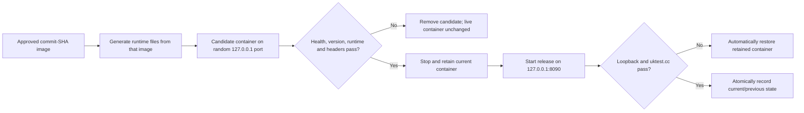

# Shared ECS host-Nginx release control

Date: 2026-07-24
Status: accepted for the Hong Kong ECS V1

## Context

The Hong Kong ECS is not a dedicated single-site host. Host Nginx already owns
ports 80 and 443, terminates TLS for `uktest.cc`, proxies that site to
`127.0.0.1:8090`, and also serves unrelated sites. The repository's portable
`compose.production.yml` includes Caddy and is appropriate for a dedicated host,
but starting it here would compete for 80/443 and could interrupt other services.

The running Web container is immutable and read-only. Browser runtime files and
the cross-release hashed-asset archive are host bind mounts. A safe release must
therefore prove the exact image, public runtime identity, old-tab assets and
public origin before it can become production state.

## Decision

Use `deploy/deploy-ecs-host-nginx.sh` as the only Web promotion path on this
shared ECS and `deploy/rollback-ecs-host-nginx.sh` as its immediate reversal
path.

The controller:

- requires a full 40-character commit SHA and an image tagged with the same SHA;
- resolves that tag to a content-addressed Docker image ID, then requires both
  the OCI revision label and the image's read-only `build-revision` file to equal
  the same commit; runtime version injection cannot disguise a different build;
- validates the existing host Nginx proxy but never edits or reloads Nginx;
- refuses privileged ports and publishes every candidate/final container only on
  loopback;
- generates `runtime-config.js` and `version.json` by running the exact image's
  own entrypoint, then removes the short-lived generator container;
- merges retained hashed assets before candidate validation;
- verifies a candidate before stopping production;
- retains the previous stopped container and restores it automatically if local
  or public verification fails after cutover;
- records only non-secret release state under
  `/opt/admission-test-breaker/deployment-state/current.json`;
- never runs global Docker pruning or mutates another site.

The server runtime file may contain only browser-public values: Supabase project
origin, publishable key, Turnstile site key, environment and release. Database,
service-role, SMTP, Turnstile secret and platform access credentials are excluded.

## Verification

`tests/architecture/ecs-release-control-contract.test.ts` checks Bash syntax,
executable modes, candidate-before-cutover ordering, exact release binding,
loopback-only publication, rollback behavior, asset retention and the read-only
host-Nginx boundary. A real promotion must additionally run
`pnpm verify:deployment`, the deployed Playwright smoke journey and production
evidence recording against the exact public release.

## Trade-offs

- The switch has a short container restart window instead of a load-balancer
  drain. This is acceptable for the initial closed Beta and far safer than
  changing a shared Nginx configuration automatically.
- Immediate rollback depends on the previous container and its bind-mounted
  runtime directory remaining present. Cleanup is therefore a separate,
  deliberate operation and is not part of promotion.
- Image download/authentication remains outside the controller. GitHub publishes
  the immutable artifact; the approved operator must make that image available
  to Docker before or during promotion.
- The script controls one host, not a fleet. Revisit a registry-driven deployment
  agent or orchestrator only when multiple hosts, zero-downtime load balancing or
  independent scaling creates real need.

## Rejected for this stage

- Starting repository Caddy on the shared ECS.
- Editing/reloading host Nginx as part of every application release.
- In-place container replacement without candidate verification.
- Rebuilding a different production artifact after staging approval.
- Global `docker system prune` during a release.
