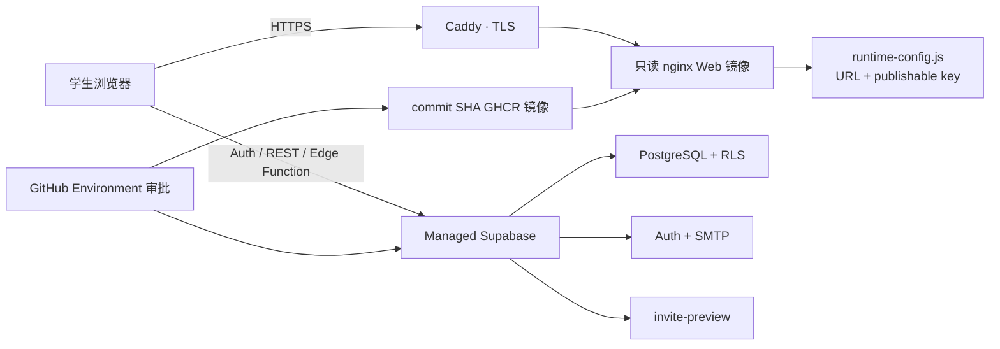

# 100 人封闭 Beta 发布与恢复手册

**当前状态：** 发布底座已在本地验证；尚未在满托 staging 或 production 执行。任何人不得把本手册当作“生产已经上线”的证据。

## 1. 生产形态



Web 镜像不包含数据库密码、service-role key、学生数据或 entitlement 正文。公开浏览器只得到 Supabase URL 与 publishable key；数据隔离继续由 PostgreSQL RLS、受认证 RPC 和私密 payload 表负责。

## 2. 环境与责任

| 环境 | 用途 | 数据 | 发布条件 |
| --- | --- | --- | --- |
| local | 开发、pgTAP、恢复和容量演练 | 合成数据 | `pnpm verify` + 本地 Supabase |
| staging | 生产前迁移、邮件、跨设备和权限验收 | 只用测试账号 | GitHub `staging` Environment 审批 |
| production | 100 人封闭 Beta | 真实学生最小必要数据 | 所有 P0 证据签字后由 `production` Environment 审批 |

初期责任：创始人/满托技术负责发布与事故总协调；满托教研负责题目与 Notes 更正；冰冰负责邀请码和学生一线响应。正式上线前必须把真实值写入私有运营通讯录，而不是提交到公开仓库。

### 生产配置预检

**Owner:** 创始人/技术责任人 | **Frequency:** 首次配置、每次发布候选
**Last Updated:** 2026-07-24 | **Last Run:** 每次发布候选以当前命令输出为准

从仓库根目录运行：

```bash
pnpm production:preflight
```

**Expected result:** 只显示仓库、工作流、GitHub Environment、secret 名称、公开 origin、SMTP 非秘密身份、审批人、当前 commit 与 Docker 状态；不会读取或打印 secret 值。`GitHub setup ready` 只表示发布控制面配置完整，不等于 Beta 已可上线。
**If it fails:** 按输出逐项处理；不要把 secret 放入命令参数、聊天、截图、仓库或任何 `VITE_*` 环境变量。

当前真实结果：GitHub 远端与 CLI 权限有效；`staging`、`production` 两个 Environment 已创建，Supabase access token、项目 ref、两个 `PUBLIC_APP_ORIGIN` 和 production required reviewer 已配置。两个独立 Supabase 项目均完成 27 个迁移并通过真实双账号隔离、邀请码与权益验证；主分支同 SHA Verify 已全绿。Turnstile secret/hostname、SMTP 供应商凭据与发件域名认证、首个物理备份和外部告警仍未完成，因此 production 浏览器账号功能尚未开放。

### Supabase 项目只读盘点与选择

**Owner:** 创始人/技术责任人 | **Frequency:** 首次选项目、组织或区域变化时

先读取当前登录账号可见的项目，不创建、不恢复、不暂停、不删除、不链接项目：

```bash
pnpm production:supabase-inventory
```

当前账号清单含两个名称不能证明用途、状态均为 `INACTIVE` 的旧项目。不得因为项目“已经存在”就直接作为本产品 staging 或 production。若要复用，必须先单独批准恢复，再检查历史用户、表、Storage、Auth、Edge Function、API key、团队成员、区域和迁移历史；本选择器在项目非 `ACTIVE_HEALTHY` 时会失败关闭。

推荐为本产品使用两个独立项目。先复制模板到 Git 忽略的本地文件，确认 organization、环境策略和数据地区，再运行 dry-run：

```bash
cp deploy/supabase-project-selection.example.json deploy/supabase-project-selection.local.json
pnpm production:supabase-plan -- --config deploy/supabase-project-selection.local.json
```

`create` 只形成计划，不接受费用；`reuse` 要求清单内、同 organization、健康且 staging/production 不能共用；`defer` 可以表达“先做 staging”，但计划不会被标记为可进入完整生产配置。配置文件不包含 access token 或 service-role key。云端迁移使用 Supabase CLI 的 Management API/JIT 通道，不持有长期数据库密码；项目创建、恢复和付费变更仍必须有明确批准、费用确认和数据地区确认。

推荐先使用默认 dry-run 的自动配置器。复制模板到已被 Git 忽略的本地文件，只填写公开 origin、SMTP host/port/发件身份、production GitHub reviewer 和 secret 的本机环境变量**名称**，不要把真实 secret 写入 JSON：

```bash
cp deploy/bootstrap-input.example.json deploy/bootstrap-input.local.json
pnpm production:bootstrap-plan -- --config deploy/bootstrap-input.local.json
```

确认计划无占位值后，在当前安全终端导入模板指定的十个 secret 环境变量。不要把值放入命令参数、shell 脚本、聊天或截图。全部值准备好以后才显式执行：

```bash
pnpm production:bootstrap-apply -- \
  --config deploy/bootstrap-input.local.json \
  --confirm CONFIGURE_MANTUO_PRODUCTION_CONTROL_PLANE
unset MANTUO_STAGING_SUPABASE_ACCESS_TOKEN \
  MANTUO_STAGING_SUPABASE_PROJECT_REF \
  MANTUO_STAGING_TURNSTILE_SECRET_KEY \
  MANTUO_STAGING_SMTP_USER \
  MANTUO_STAGING_SMTP_PASS \
  MANTUO_PRODUCTION_SUPABASE_ACCESS_TOKEN \
  MANTUO_PRODUCTION_SUPABASE_PROJECT_REF \
  MANTUO_PRODUCTION_TURNSTILE_SECRET_KEY \
  MANTUO_PRODUCTION_SMTP_USER \
  MANTUO_PRODUCTION_SMTP_PASS
```

执行器会在任何写入前一次确认十个值全部存在；缺一个即零写入。secret 只通过 stdin 交给 GitHub CLI，stdout/stderr 被丢弃；公开 origin 和 SMTP 非秘密身份可以进入 variable。Environment 已存在时不会重建，已有 required reviewer 达标时不会覆盖，外部调用失败立即停止，可修复后安全重跑。最后会自动执行独立只读 bootstrap gate。自动配置只处理 GitHub 控制面，绝不代表真实邮件、Turnstile hostname、DNS/TLS、平台恢复、告警或 Beta 人工门已经完成。

以下逐条命令保留为故障排查与受控人工回退路径。先创建环境：

```bash
gh api --method PUT repos/Mantuo-Edutech/Admission-Test-Breaker/environments/staging
gh api --method PUT repos/Mantuo-Edutech/Admission-Test-Breaker/environments/production
```

为两个环境分别安全输入五个 secret；命令会交互读取值，不应把值写在命令行：

```bash
gh secret set --env staging SUPABASE_ACCESS_TOKEN
gh secret set --env staging SUPABASE_PROJECT_REF
gh secret set --env staging TURNSTILE_SECRET_KEY
gh secret set --env staging SMTP_USER
gh secret set --env staging SMTP_PASS

gh secret set --env production SUPABASE_ACCESS_TOKEN
gh secret set --env production SUPABASE_PROJECT_REF
gh secret set --env production TURNSTILE_SECRET_KEY
gh secret set --env production SMTP_USER
gh secret set --env production SMTP_PASS
```

再写入公开 origin 与 SMTP 非秘密身份：

```bash
gh variable set --env staging PUBLIC_APP_ORIGIN --body 'https://<staging-domain>/'
gh variable set --env production PUBLIC_APP_ORIGIN --body 'https://<production-domain>/'
for environment in staging production; do
  gh variable set --env "$environment" SMTP_HOST --body 'smtp.<provider-domain>'
  gh variable set --env "$environment" SMTP_PORT --body '587'
  gh variable set --env "$environment" SMTP_ADMIN_EMAIL --body 'no-reply@auth.uktest.cc'
  gh variable set --env "$environment" SMTP_SENDER_NAME --body '满托 UK Test'
done
```

production 必须至少有一名 required reviewer。先解析批准人的 GitHub 数字 ID，再更新保护规则：

```bash
REVIEWER_ID="$(gh api users/<approved-github-username> --jq .id)"
jq -n --argjson reviewer_id "$REVIEWER_ID" \
  '{wait_timer:0,prevent_self_review:true,reviewers:[{type:"User",id:$reviewer_id}],deployment_branch_policy:null}' \
  | gh api --method PUT \
      repos/Mantuo-Edutech/Admission-Test-Breaker/environments/production \
      --input -
unset REVIEWER_ID
```

重新运行 `pnpm production:preflight`。机器配置齐全后，`pnpm production:bootstrap-gate` 应成功；正式发布候选还必须位于 `main`、无未提交修改、当前 SHA 已推送，并且该 SHA 自己拥有成功的 GitHub `Verify` 运行，使用 `pnpm production:release-candidate-gate` 复核。任何一个命令通过都不能代替 SMTP、真实邮件、Turnstile hostname、域名/TLS、平台恢复、告警和责任人五项人工生产证据；最终仍以 `pnpm beta:gate` 为准。

| Symptom | Likely cause | Fix |
| --- | --- | --- |
| Environment 返回 404 | 尚未创建或当前 GitHub 身份无权限 | 用上述 `gh api --method PUT` 创建；仍失败则由组织 Owner 复核权限 |
| secret 显示 missing | 名称拼写错误或写在 repository secret 而不是 environment secret | 对目标环境重新执行对应 `gh secret set --env` |
| `PUBLIC_APP_ORIGIN` 失败 | 使用 HTTP、localhost、占位域名或包含额外 path | 只写 `https://hostname/` |
| SMTP variable 失败 | hostname/邮箱仍为占位值、端口不受支持或发件名称为空 | 使用供应商正式 hostname、465/587/2525、已认证发件域名和 2–80 字符名称 |
| production reviewers 失败 | 未配置 required reviewer 或 protection rule 未保存 | 重新运行 reviewer 配置并用 `gh api .../environments/production` 查看规则 |
| release candidate 失败 | 不在 main、工作树未提交、当前 SHA 未推送，或该 SHA 没有成功 Verify run | 经 Pull Request 合并 main，等待同一 SHA 的 Verify 全部通过；不要借用其他 commit 的绿灯 |

**Rollback:** 删除错误的 environment variable/secret 名称并重新设置；若 Environment 指向错误项目，立即停止 workflow，撤销相关 token，再由批准人核对后重建。不要通过打印 secret 排查。
**Escalation:** GitHub 组织权限问题交给组织 Owner；Supabase 项目/数据库凭据交给创始人或技术责任人；Turnstile/域名问题交给域名和安全配置负责人。

内容责任不能只写“教研已看过”。`content/products/release-readiness.json` 为每个产品列出尚未关闭的自动与人工阻塞项；`content/products/manual-review-worklist.json` 再把它们去重为 68 个可执行审核组：25 个学科/双语/权利、12 个真实学生标定、31 个设备/无障碍。每项已经绑定当前产品版本、全部路由、源文件数量和由真实 evidence/claim artifacts 计算的 SHA-256 指纹。上线批次中的全部产品必须按指定角色与证据要求执行；使用 `pnpm review:prepare -- --review-key <key> --output <dir>` 生成审核包，把无个人资料的最终报告保存到 `verification/reviews/evidence/`，再用 `pnpm review:record -- --input <draft.json>` 记录负责人、适任审核者、独立性、日期、结论和 attestation。记录后依次重建 release readiness 与剩余 worklist。旧结论在源内容变化后会自动 stale，`changes-requested` 不会放行，证据文件被修改则门禁失败。自动命令只验证证据链，不能代替人工审核。当前报告仍为 40/40 公开产品自动证据通过、0/40 完成人工门，因此在相应检查真实留痕前不得把它们标记为“Beta 内容终审通过”。

审核台生产同步与验收必须按以下顺序执行：

1. 在无生产写入的环境运行 `pnpm content-review:sync`，核对 revision、68 个审核组和 40 个公开产品。
2. 只在受控服务端环境设置 `SUPABASE_URL`、`SUPABASE_SERVICE_ROLE_KEY` 与精确确认值 `CONTENT_REVIEW_SYNC_CONFIRM=sync-current-content-review-queue`，再运行 `pnpm content-review:sync:apply`。严禁设置或使用 `VITE_SUPABASE_SERVICE_ROLE_KEY`。
3. 由 service role 调用 `configure_content_review_viewer`，仅把能力授予已完成邮箱验证和 MFA 的具名审核账号；审核者从 `/operations/content-review` 进入。
4. 用普通学生账号确认列表拒绝；用审核账号确认 68 项队列、考试/活动筛选、真实站内产品路由和两份审核包下载；随后撤销角色并刷新，确认访问立即拒绝。
5. 下载模板不等于批准。把完成后的 Markdown 放入 `verification/reviews/evidence/`，补全决定草稿，再运行 `pnpm review:record -- --input <decision-draft.json>`；最后重建 release readiness 与 manual worklist。只有这条链路才能改变 0/40 人工门。

邀请码签发不能靠运营人员记忆内容状态。底层 `issue_invite` 继续只允许 `service_role`，并强制每个权限包至少包含一项已经正式发布的 entitled 资源；只有草稿占位的包会以 `invite_package_unpublished` 失败。冰冰账号由批准的技术责任人通过 `configure_invite_operator` 单独授予或撤销邀请运营能力，浏览器只能使用受约束的 operator RPC：列出已发布资料包、签发有限期代码、查看/撤销本人代码和查看本人审计。`/operations/invites` 已按本人队列接入这些 RPC；入口只在账号二次角色检查通过后出现，直接访问仍会重新验证。不得直接写私有表或把 service-role key 放入冰冰浏览器，也不得用共享表格保存明文邀请码。

每项从练习结果销售或解锁的逐题解析还必须在 `content/products/catalog.json` 的 `relatedPracticeIds` 声明真实练习关系。产品 ID、题目 `explanationResourceId` 和服务端 `content_resources.id` 必须完全一致；不得在 React 页面写死题量、产品名或“可解锁”承诺。发布前必须验证 locked、available、第二账号拒绝、revoked 四种服务端状态，以及“原结果 → 冰冰/已有邀请码 → 未登录注册或登录／已登录直接核销 → 返回原结果”三视口流程。另用第二浏览器打开邮箱确认链接：若 pending code 不存在，页面必须只显示邮箱已确认并要求重新输入原邀请码，不能显示资料已解锁。返回地址只能是经校验的站内路径，兑换后必须清除；明文邀请码不得放入 URL，它也不能替代 entitlement。若任一映射冲突，先撤下入口并修复目录，不得让运营口头补偿产品缺失。

运营角色不等于管理员。它不返回学生账号、邮箱、核销者身份、答案、档案或学习事件；列表只有非个人化 reference、资料包、有效期、核销次数和状态。邀请码 reference 禁止邮箱、URL 和明显手机号，明文 code 只在签发响应出现一次，审计中只保存受控 metadata。撤销邀请码只阻止未来核销，不暗中撤销学生已经获得的 entitlement；后者属于更高权限的支持/退款流程。

生产启动时，先让冰冰完成正常邮箱验证与 MFA，再由受批准的 service-role 环境执行：

```sql
select * from public.configure_invite_operator(
  '<bingbing-auth-user-uuid>'::uuid,
  '冰冰',
  true,
  'Founder-approved Beta invite operations'
);
```

角色撤销使用同一函数并把第三个参数设为 `false`。每次授予、撤销、签发和代码撤销都会进入私有审计；生产演练必须保存事件数量和时间，不保存明文 code。冰冰只能读取与本人有关的审计；创始人或受批准的事故负责人可在不暴露 service-role key 的受控终端复核跨运营者事件：

```sql
select * from public.list_invite_operator_audit(
  now() - interval '30 days',
  100
);
```

该全局审计函数只授予 `service_role`，限制在最近 365 天和最多 500 条；返回受控 reference 与事件 metadata，不返回明文邀请码或核销学生身份。

匿名转化看板使用另一项完全独立的 `product_funnel_viewer` capability；它不会因为某人是邀请码运营者而自动开启，也不会授予 Learner Space、反馈或私密内容访问。创始人先完成邮箱验证与 MFA，再由同一类受控 service-role 终端执行：

```sql
select * from public.configure_product_funnel_viewer(
  '<founder-auth-user-uuid>'::uuid,
  '满托创始人',
  true,
  'Founder-approved aggregate conversion analytics'
);
```

账号二次角色检查通过后才显示 `/operations/funnel`。页面只查询 7/30/90 天内按考试和固定动作汇总的 event count 与 unique Journey count；不得将其解释成同一批学生的严格转化率，也不得反查某个学生。撤销时调用同一函数并把第三个参数设为 `false`。生产演练必须保存普通学生拒绝、批准者可见、撤销后立即拒绝和原始表始终拒绝四类证据；任何共享账号、关闭 MFA、复制 service-role key 到浏览器或导出原始事件的做法都违反该能力边界。

### 学生 Grant 的双账号生产验收

**Owner:** 隐私负责人 + 技术负责人 | **Frequency:** 首次部署、授权模型变更和每次重大身份升级

准备两个已验证邮箱且开启 MFA 的测试账号：一个学生，一个老师或家长。不得使用冰冰运营账号或创始人漏斗看板账号替代协作者，以免隐藏权限边界问题。

1. 学生登录 `/account/sharing`，只勾选一个考试、`progress:read` 和 `plans:write`，有效期选 7 天，生成一次性协作码。记录 invite ID 和时间，不在截图或工单保存明文 code。
2. 协作者登录自己账号，在 `/collaboration/redeem` 兑换；同一 code 的第二次兑换必须失败，学生自兑换必须失败。
3. 协作者能在 `/collaboration/<grant-id>` 查看汇总进度并创建计划，但具体作答、批注和布置练习必须显示未授权，直接 RPC 请求也必须返回拒绝。
4. 使用第三个普通账号请求同一 Grant；列表、进度、作答与协作内容全部必须拒绝。
5. 学生查看审计，应看到邀请、兑换、进度读取和计划写入；导出 JSON 应为 schema v4，含邀请、Grant、计划和审计，不含 code digest。
6. 协作者保持工作区页面打开时，学生点击“立即撤销”。协作者刷新或执行下一次读写必须立即失败，学生仍能看到历史计划和撤销审计。
7. 在电脑、iPad 和手机各完成一次，另以键盘与 VoiceOver/屏幕阅读器验证五项勾选、码兑换、权限状态和撤销。

**Expected result:** 学生所选权限的正向动作可用，其他权限、考试和账号全部在服务端失败；撤销立即生效且审计与导出完整。
**If it fails:** 立即停止真实学生 Beta，保留 release SHA 与不含答案/明文 code 的时间线；跨账号或撤销失效按 SEV-1 处理。
**Rollback:** 回滚 Web 到上一已验证 SHA；数据库采用前向修复，不在生产 reset。如权限面不可信，先批量撤销活动 Grant 并暂时下线协作路由。

## 3. 一次性生产配置

GitHub 的 `staging` 与 `production` Environments 各自配置：

- Secrets：`SUPABASE_ACCESS_TOKEN`、`SUPABASE_PROJECT_REF`、`TURNSTILE_SECRET_KEY`、`SMTP_USER`、`SMTP_PASS`；
- Variables：`PUBLIC_APP_ORIGIN`、`TURNSTILE_SITE_KEY`、`SMTP_HOST`、`SMTP_PORT`、`SMTP_ADMIN_EMAIL`、`SMTP_SENDER_NAME`；
- Required reviewers：至少创始人/技术责任人一人；production 不允许无审批自动发布。

专用单站服务器从 `deploy/.env.production.example` 创建不进 Git 的 `.env.production`。现有香港共享 ECS 改用 `deploy/ecs-host-nginx.env.example` 生成宿主机权限为 `0600`、不进 Git 的 `ecs-host-nginx.env.local`。两者都只允许浏览器公开配置：Supabase publishable key 与 `TURNSTILE_SITE_KEY`；Turnstile secret、数据库 URL、service-role key、SMTP 凭据和 GitHub token 不得放入该文件或任何 `VITE_*` 变量。

Supabase 项目还必须完成：正式域名 redirect allowlist、自定义 SMTP、CAPTCHA/滥用保护、团队 MFA、网络/SSL 安全检查、备份计划和 Auth 邮件模板。平台的现行生产检查清单见：https://supabase.com/docs/guides/deployment/going-into-prod

Turnstile 必须为 staging 和 production 分别创建只允许对应 hostname 的 Managed widget。将公开 site key 放入各环境 Web 服务器的 `TURNSTILE_SITE_KEY`，将 secret 放入对应 GitHub Environment。Supabase 发布工作流会自动应用服务端配置，也可在批准终端中独立执行：

先复制 `deploy/turnstile-bootstrap.example.json` 为不进 Git 的 `deploy/turnstile-bootstrap.local.json`。Cloudflare account ID 与仅含 **Account / Turnstile Sites / Write** 的 API token 放入该配置指定的本机安全环境变量；不得写进 JSON 或聊天记录。先离线审查计划，再显式应用和只读复核：

```bash
pnpm production:turnstile-plan -- --config deploy/turnstile-bootstrap.local.json
pnpm production:turnstile-apply -- \
  --config deploy/turnstile-bootstrap.local.json \
  --confirm CONFIGURE_MANTUO_TURNSTILE_WIDGETS
pnpm production:turnstile-check -- --config deploy/turnstile-bootstrap.local.json
```

apply 会创建或校正两个 Managed widget，把公开 site key 写入 GitHub Environment variable，并通过 stdin 写入私密 secret；随后重新读取 Cloudflare 与 GitHub 做精确比对。它不会打印任何 key。已有 widget region 不正确时会失败关闭，因为 Cloudflare 不允许原地修改；不得为了绕过检查而放宽 hostname。

Supabase 发布工作流会自动应用服务端 CAPTCHA 配置，也可在批准终端中独立执行：

```bash
export SUPABASE_ACCESS_TOKEN='<scoped-management-token>'
export SUPABASE_PROJECT_REF='<approved-project-ref>'
export PUBLIC_APP_ORIGIN='https://practice.example.com'
export TURNSTILE_SECRET_KEY='<secret-from-secure-store>'
pnpm supabase:auth-protection:apply
unset TURNSTILE_SECRET_KEY
pnpm supabase:auth-protection:check
```

`check` 只输出 CAPTCHA 开关/provider、site URL 是否匹配、邮件确认状态和最小密码长度，不读取或显示 secret。apply 会合并而非删除已有 redirect allowlist，并强制邮件确认、10 位大小写字母加数字密码与 refresh-token rotation。前端必须同时验证注册、登录和密码重置；还要覆盖 token 过期、重复使用、网络失败和 429。Supabase Auth 负责服务端校验，浏览器按钮状态不构成安全边界。参考：https://supabase.com/docs/guides/auth/auth-captcha 和 https://supabase.com/docs/guides/auth/rate-limits

SMTP 供应商完成账号和发件域名认证后，Supabase 发布工作流会自动应用并复核 Auth SMTP。批准终端也可以独立执行：

```bash
export SUPABASE_ACCESS_TOKEN='<scoped-management-token>'
export SUPABASE_PROJECT_REF='<approved-project-ref>'
export SMTP_HOST='smtp.<provider-domain>'
export SMTP_PORT='587'
export SMTP_ADMIN_EMAIL='no-reply@auth.uktest.cc'
export SMTP_SENDER_NAME='满托 UK Test'
export SMTP_USER='<secret-from-secure-store>'
export SMTP_PASS='<secret-from-secure-store>'
pnpm supabase:auth-smtp:apply
unset SMTP_PASS
pnpm supabase:auth-smtp:check
unset SMTP_USER
```

`apply` 写入后会重新读取远端配置，检查 host、port、发件身份、凭据已存储、邮箱确认和安全邮箱变更；输出只有布尔状态，不显示 username/password。`check` 不需要 `SMTP_PASS`，但需要 `SMTP_USER` 用于精确身份比对。真实完成还必须验证 SPF、DKIM、DMARC、至少一个非团队邮箱的注册确认和密码重置，以及退信/失败日志。参考：https://supabase.com/docs/guides/auth/auth-smtp

## 4. 发布顺序

1. 合并前 GitHub `Verify` 必须通过应用、数据库、恢复、100 用户容量和容器五个 job；内容负责人另外运行 `pnpm verify:manual-review-ledger`、`pnpm verify:content-release-readiness` 与 `pnpm verify:manual-review-worklist`，确认目标产品的人工决定仍对应当前源文件、证据未被改写且没有未解释、遗漏或重复的阻塞项。
2. 运行 `Release immutable image`，选择 staging；它只发布 `ghcr.io/mantuo-edutech/admission-test-breaker:<commit-sha>`。
3. 运行 `Deploy Supabase environment`，输入同一 SHA 和 staging。工作流先通过 Management API 对比远端迁移历史，再将每个待执行 migration 与历史记录放在同一事务中应用；production 还会在任何 migration 写入前要求一个最近 30 小时内的真实托管恢复点。随后启用并复核 Auth Turnstile、自定义 SMTP，配置 `ALLOWED_ORIGINS` 并部署 `invite-preview`。远端存在仓库没有的迁移、production 没有恢复点或 Auth 配置不完整时必须失败关闭。
4. staging 服务器使用同一 SHA 更新 `APP_IMAGE` 与 `APP_RELEASE`。专用单站主机可以使用 Compose；**香港共享 ECS 不得启动该 Compose 内的 Caddy**，因为宿主机 Nginx 已经为多个站点占用 80/443。共享 ECS 使用：

   ```bash
   if [ ! -f /opt/admission-test-breaker/ecs-host-nginx.env.local ]; then
     install -m 0600 deploy/ecs-host-nginx.env.example \
       /opt/admission-test-breaker/ecs-host-nginx.env.local
   fi
   # 在批准终端填写浏览器公开值、准确 commit SHA，以及 release workflow
   # 输出的 EXPECTED_IMAGE_DIGEST；不放任何 secret。
   set -a
   . /opt/admission-test-breaker/ecs-host-nginx.env.local
   set +a
   deploy/deploy-ecs-host-nginx.sh
   ```

   发布器先验证宿主机 Nginx 仍代理 `127.0.0.1:8090`，强制 pull SHA tag，并要求 release workflow 的 manifest digest、SHA tag、OCI revision label、镜像内只读 build-revision 四者一致；然后才由准确镜像生成 runtime 文件、合并最近 14 天哈希资源、在随机 loopback 端口完成候选验证。GHCR 包保持私有时，应通过 Docker credential store 使用只含 `read:packages` 的凭据；token 不得出现在 runtime env、云助手命令或 release state。候选通过后才保留旧容器并切换 8090；新版本在 loopback 或公开域名验证失败时自动恢复旧版本。它不编辑或 reload Nginx，不绑定 80/443，不清理其他容器或镜像。成功状态写入 `/opt/admission-test-breaker/deployment-state/current.json`，上一容器保持停止但可立即恢复：

   ```bash
   deploy/rollback-ecs-host-nginx.sh
   ```

   不得在记录完真实线上验证和回滚证据前删除该容器、对应 runtime 目录或旧镜像。详细决策见 `docs/architecture/decisions/2026-07-24-shared-ecs-release-control.md`。

5. 验证实际运行版本：

   ```bash
   DEPLOYMENT_BASE_URL=https://staging.example.com \
   EXPECTED_RELEASE=<commit-sha> \
   EXPECTED_ENVIRONMENT=staging \
   EXPECTED_SUPABASE_PROJECT_REF=<staging-project-ref> \
   pnpm verify:deployment
   ```

   该命令会解析实际 runtime 值、拒绝占位或错误 project ref，并以 publishable key 调用 `/auth/v1/health` 与 `/auth/v1/settings`。输出通过只代表 Web/Auth 基础可达，不代表 SMTP 邮件已真正送达。
6. 在两个真实设备上完成：邀请码预检 → 注册/邮件确认 → 登录 → 保存档案 → 开始/恢复/提交 → 查看私密资料 → 第二账号拒绝 → 内容权限撤销后拒绝 → 导出/删除；另按上述清单使用学生+协作者双 MFA 账号完成 Grant 限权读写、审计和即时撤销。
7. 记录证据后，使用相同 SHA 和同一套步骤提升到 production；不得重新编译另一个“生产版本”。

## 5. 备份与恢复

### 主恢复路径

100 人 Beta 至少使用带每日平台备份的 Supabase 付费方案。初始目标为 **RPO ≤ 24 小时、RTO ≤ 4 小时**；若真实训练频率证明 24 小时损失不可接受，再启用 PITR。Supabase 当前说明付费项目提供每日平台备份，而 Storage 对象不包含在数据库备份中：https://supabase.com/docs/guides/platform/backups

付费方案产生第一个备份后，从保存了目标 Environment secret 的 GitHub workflow 运行 production 发布；它会在 migration 前自动执行：

```bash
SUPABASE_ACCESS_TOKEN='<scoped-management-token>' \
SUPABASE_PROJECT_REF='<approved-production-ref>' \
pnpm supabase:managed-backups:check
```

验证器只调用 Management API 的备份读取 endpoint，不恢复、不更新、不删除项目，也不打印 token。`walg_enabled` 本身不算通过；必须存在最近 30 小时内完成的每日备份，或有效的 PITR 恢复窗口。30 小时是允许日备份调度与检查延迟的自动门禁容差，不改变事故目标 RPO 24 小时。该命令通过只证明恢复点存在，不代替下面的恢复到新项目演练。

灾难恢复必须恢复到**新项目**，而不是先覆盖仍可取证的生产项目。恢复后还要重新核对 Edge Function、Auth 设置/API key、SMTP、Realtime、扩展和网络限制；平台的新项目恢复也明确列出这些非数据库配置：https://supabase.com/docs/guides/platform/clone-project

### 补充逻辑备份

```bash
SUPABASE_SOURCE_DB_URL='<session-pooler-url>' pnpm backup:supabase-logical
```

产物权限默认是 `0600` 语义，并带 SHA-256 manifest；必须加密后存到 Supabase 账户之外。逻辑备份不进入 Git。恢复只允许指向新 staging/recovery 项目：

```bash
SUPABASE_TARGET_DB_URL='<new-project-url>' \
BACKUP_DIRECTORY='.backups/supabase/<timestamp>' \
RESTORE_TARGET_ENVIRONMENT='recovery-drill' \
CONFIRM_NON_PRODUCTION_RESTORE='RESTORE_TO_NEW_NON_PRODUCTION_PROJECT' \
pnpm restore:supabase-logical
```

该命令遵循 Supabase 官方 roles → schema → data 的单事务恢复顺序：https://supabase.com/docs/guides/platform/migrating-within-supabase/backup-restore

### 已有本地证据

- `pnpm verify:recovery-local`：创建真实 Auth 标记用户和反馈/审计标记，完整 dump 后恢复到隔离数据库，并比对 Auth、应用账号、Learner Space、7 项资源、2 份私密 payload、反馈、审计事件和 16 条 RLS policy；2026-07-18 已通过。
- `pnpm verify:beta-load-local`：100 个隔离用户、并发 10，完成邀请码、档案、开始、提交与站内反馈；最近一次本机 p50 24ms、p95 62ms、最大 103ms。它证明代码路径和本地容量，不代替生产地区网络/SMTP/数据库负载测试。

## 6. 监控与告警

站内 P1-P4 反馈队列、题目纠错发布步骤与隐私升级边界见 [站内反馈与题目纠错运行手册](FEEDBACK_AND_CONTENT_CORRECTION_RUNBOOK.md)。生产告警必须覆盖 P1 隐私安全报告和 P2 核心学习故障；仅有数据库队列、不指定接收人不能视为监控完成。

Beta 前至少配置：

- 外部可用性：每分钟请求 `/healthz`，另请求首页确认非 5xx；
- 关键页面：仓库内 `Deployment smoke` workflow 每日两次检查 production，也可人工选择 staging；它会运行 `verify:deployment`，并在桌面/手机尺寸检查五考试入口、账号入口和 TMUA AP Guest 路径。GitHub Environment 必须配置 `PUBLIC_APP_ORIGIN`，缺失时检查明确失败；
- 版本：部署后保存 `/version.json`，事故记录必须包含 release SHA；
- Supabase：Auth、Database、Edge Function 错误率和连接数告警；
- 关键旅程：`record_product_funnel_event` 已只允许选择考试、完成档案、开始/提交、主动打开冰冰、邀请码成功六类动作；随机 Journey ID 不连接账号或 Learner Space，表中没有邮箱、IP、设备、课程、答案或自由文本字段。匿名/学生角色只能追加；只有 service-role 或经 service-role 单独授予的 `product_funnel_viewer` 能读取汇总，批准浏览器 RPC 只返回按考试/动作聚合的 event count 与 unique Journey count，不返回 context 或原始行；
- 漏斗保留：至少每周由受控运维任务调用 `purge_expired_product_funnel_events()` 清理 90 天前的计数。不得把 service-role key 放进前端、报表链接或冰冰浏览器；生产部署后必须用匿名、普通学生、批准看板账号和撤销后的账号分别证明“只能追加 / 不能汇总 / 只能汇总 / 立即拒绝”，并持续证明所有浏览器角色都不能读取原始行；
- 接收人：技术事故到创始人/技术责任人，内容错误到教研，账号与邀请码到冰冰；正式手机号/邮箱只放私有值班表。

没有配置真实外部检查和接收人之前，监控仍是 P0 未完成。

## 7. 回滚与事故

Web 回滚只把 `APP_IMAGE` 和 `APP_RELEASE` 改回上一已验证 SHA，再执行 compose pull/up。数据库 migration 默认只前向修复；禁止直接 reset 生产数据库。涉及数据损坏时：冻结写入/邀请码发放、保留日志、评估影响范围、选择前向修复或恢复到新项目，并分别通知学生支持、隐私责任人与教研。

严重度：

- SEV-1：跨用户数据可见、账号大规模不可用、数据不可恢复；立即停止 Beta 与新注册。
- SEV-2：练习无法保存/提交、邀请码大面积失败、关键资料错误；同日处理并主动告知受影响学生。
- SEV-3：单题排版、非关键文案或局部浏览器问题；进入内容更正队列并保留来源证据。

事故关闭必须留下时间线、影响用户数、release SHA、数据处理情况、修复验证和防复发动作。

## 8. P0 生产证据与最终放行

静态 readiness 文件只描述基线与要求。最终状态必须由当前证据推导：

```bash
pnpm production:evidence:audit
```

该命令缺少生产 secret 时仍可安全运行，并逐项显示“尚无证据、过期、release 不匹配或控制源已变化”。生产部署后，先把准确的 40 位 commit SHA 放入当前终端，再逐项执行自动控制：

```bash
export PRODUCTION_EVIDENCE_RELEASE='<deployed-commit-sha>'
pnpm production:evidence:run --control deployment-runtime
pnpm production:evidence:run --control auth-protection
pnpm production:evidence:run --control auth-smtp
pnpm production:evidence:run --control remote-learner-data-contract
pnpm production:evidence:run --control managed-backup
```

每个命令只允许执行控制目录里固定的 `pnpm` 脚本。终端继续显示原验证输出，但账本只保存退出状态、输出字节数和 SHA-256，不保存原文、secret 或临时测试账号。失败也会记录，并作为该控制最新结论覆盖旧成功。

人工控制必须先把已经去除姓名、邮箱、邀请码、学生答案和其他个人数据的证据文件放到 `verification/production/evidence/artifacts/`，再由实际完成者记录。例如：

```bash
export PRODUCTION_EVIDENCE_REVIEWER_REF='approved-reviewer-01'
export PRODUCTION_EVIDENCE_REVIEWER_ROLE='production-uat-owner'
export PRODUCTION_EVIDENCE_ATTESTATION='I_COMPLETED_THIS_PRODUCTION_CONTROL'
pnpm production:evidence:record-manual \
  --control identity-journey-uat \
  --result passed \
  --summary 'Production identity journey passed on approved real devices.' \
  --artifact verification/production/evidence/artifacts/identity-journey-redacted.md
```

法律审核、恢复演练、MFA 所有权、告警接收人和真实设备 UAT 都使用各自 control ID；不得复用一个笼统截图替代多个结论。最后运行：

```bash
PRODUCTION_EVIDENCE_RELEASE='<deployed-commit-sha>' pnpm production:evidence:gate
PRODUCTION_EVIDENCE_RELEASE='<deployed-commit-sha>' pnpm beta:gate
```

两者都显示 P0 6/6 后才可宣布 100 人封闭 Beta ready。账本结构、失效规则和人工边界见 `docs/architecture/decisions/2026-07-24-source-bound-production-evidence-ledger.md`。
